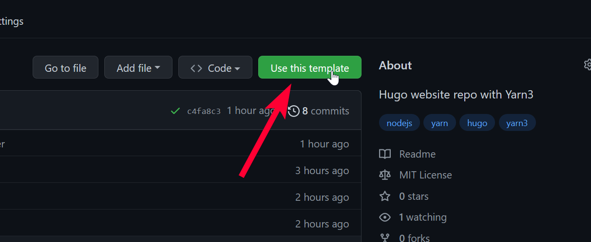

# `yarn3-hugo` Project Template

I've added a new project template to quickly set up a [Hugo](https://gohugo.io)-based website, like this blog.

Check it out: <https://github.com/oliversalzburg/yarn3-hugo>

## Key Features

- The project repository and dependencies are to be [managed with **modern Yarn** (Berry/v2/v3)](https://yarnpkg.com/).

    - [Yarn Plug 'n' Play, or PnP](https://yarnpkg.com/features/pnp) has been disabled in favor of using `node_modules`. PnP is generally preferred for strictness, but `node_modules` incur less friction.
    - The default configuration does not utilize [Yarn Zero-Installs](https://yarnpkg.com/features/zero-installs), which are usually enabled by default in new projects.

- The project's primary output is a static website, [built with **Hugo**](https://gohugo.io/).

- [Deploys to GitHub Pages](https://pages.github.com/), using [GitHub Actions](https://github.com/features/actions).

- Code quality assistence through [EditorConfig](https://editorconfig.org/) + [Prettier](https://prettier.io/) + [lint-staged](https://github.com/okonet/lint-staged).

    - A git pre-commit hook for lint-staged is created through Yarn. [Husky](https://github.com/typicode/husky) is strictly discouraged.

- Enables [Renovate](https://github.com/renovatebot/renovate) to keep dependencies updated. The dependency dashboard is disabled.

- Where possible, Markdown formatting has been adjusted to conform to [Python-Markdown](https://python-markdown.github.io/#differences), so that it will work well with [MkDocs](https://www.mkdocs.org/). [mkdocs-material](https://squidfunk.github.io/mkdocs-material/) is the suggested route to adopt documentation.

## How to use

To use this template, go to <https://github.com/oliversalzburg/yarn3-hugo> and click **Use this template**.

