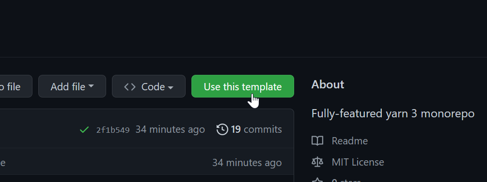

# yarn3-monorepo Project Template

I've taken the learnings from the previously created project templates and merged them into a monorepo.

Check it out: <https://github.com/oliversalzburg/yarn3-monorepo>

## Key Features

-   The project repository and dependencies are to be [managed with **modern Yarn** (Berry/v2/v3)](https://yarnpkg.com/).

    -   [Yarn Plug 'n' Play, or PnP](https://yarnpkg.com/features/pnp) has been disabled in favor of using `node_modules`. PnP is generally preferred for strictness, but `node_modules` incur less friction.
    -   The default configuration does not utilize [Yarn Zero-Installs](https://yarnpkg.com/features/zero-installs), which are usually enabled by default in new projects.

-   The template contains a [mkdocs-material](https://squidfunk.github.io/mkdocs-material/) documentation website, which is automatically [deployed to GitHub Pages](https://pages.github.com/), using [GitHub Actions](https://github.com/features/actions).

-   Additionally, it contains:

    1. A TypeScript-authored JavaScript library, built with `tsc` (to get fully-featured TypeScript definitions).

    2. A NodeJS application, that uses the library and is built with `esbuild`.

        This is <https://github.com/oliversalzburg/yarn3-typescript-nodejs-esbuild> adopted for a monorepo.

    3. A web application, that uses the library and is built with `snowpack`.

        This is <https://github.com/oliversalzburg/yarn3-typescript-web-snowpack> adopted for a monorepo.

-   Code quality assistence through [EditorConfig](https://editorconfig.org/) + [Prettier](https://prettier.io/) + [lint-staged](https://github.com/okonet/lint-staged).

    -   A git pre-commit hook for lint-staged is created through Yarn. [Husky](https://github.com/typicode/husky) is strictly discouraged.

-   Enables [Renovate](https://github.com/renovatebot/renovate) to keep dependencies updated. The dependency dashboard is disabled.

## How to use

To use this template, go to <https://github.com/oliversalzburg/yarn3-monorepo> and click **Use this template**.

