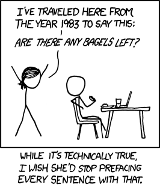
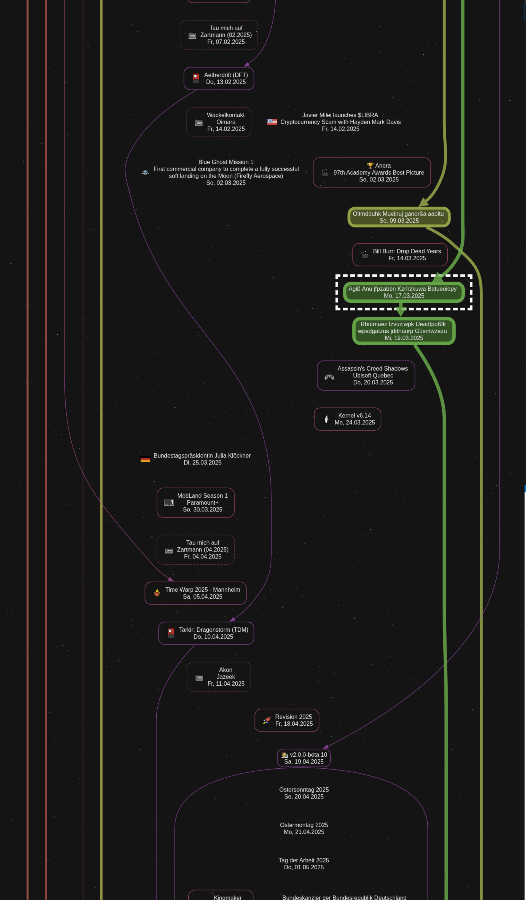
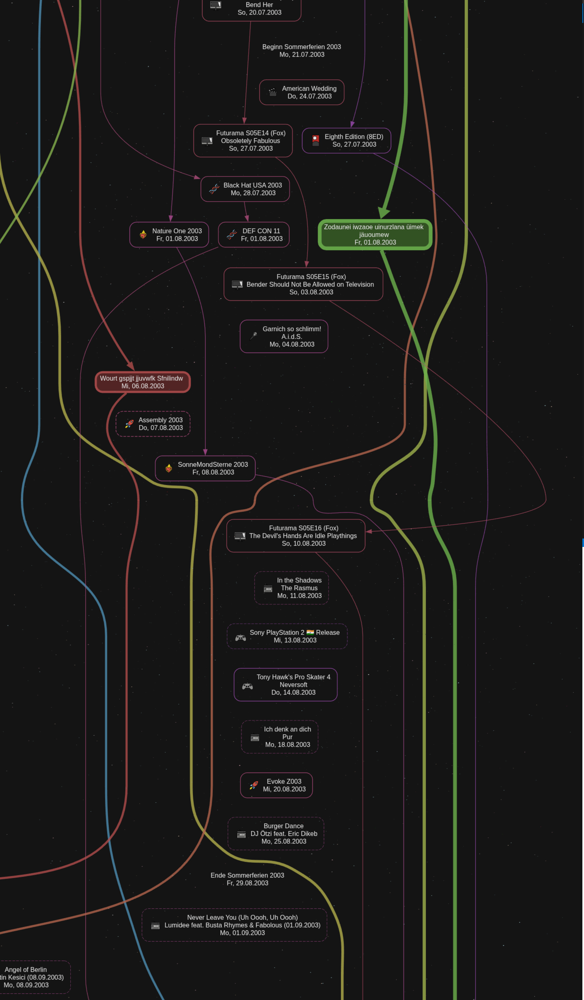
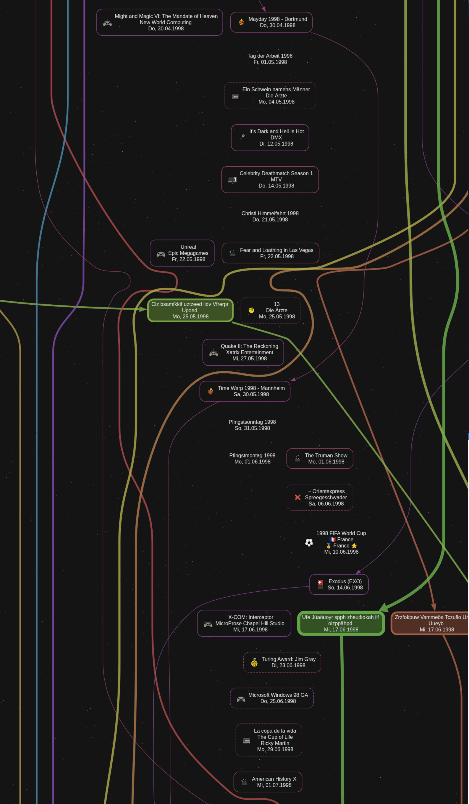
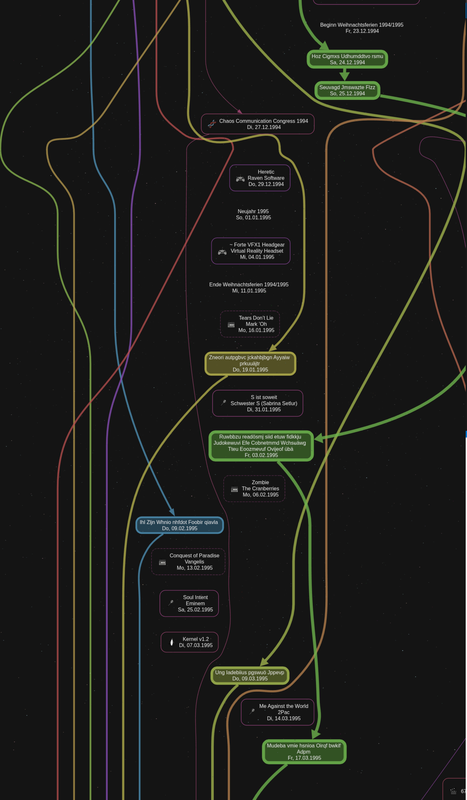
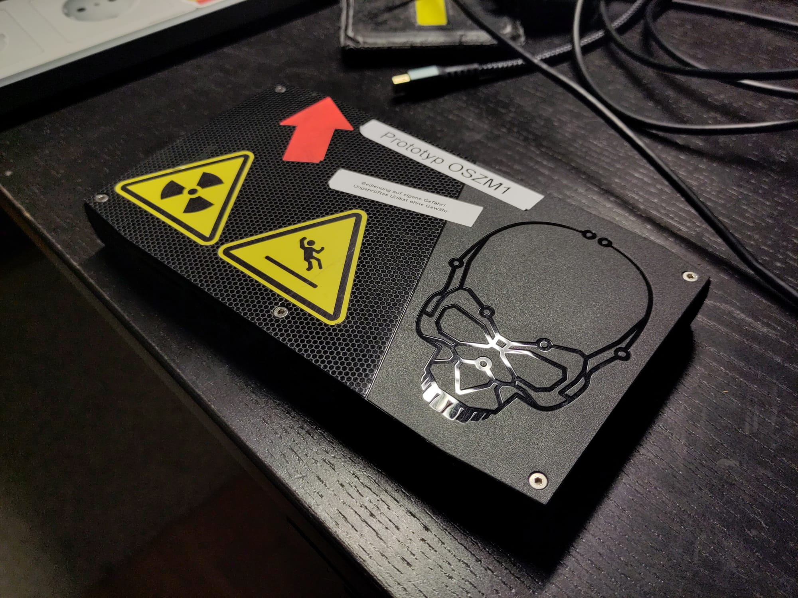
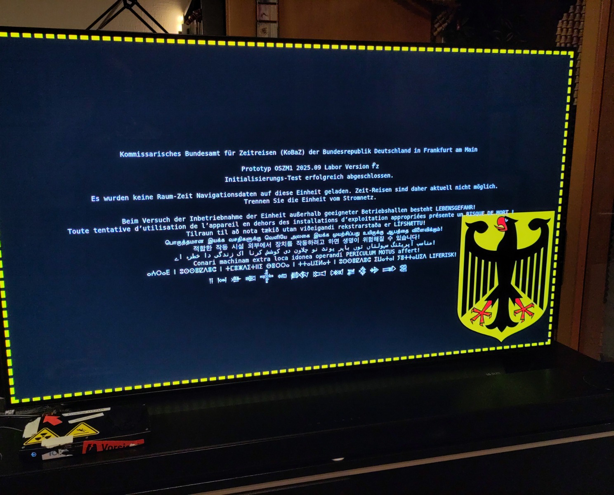

# How I built a Time Machine (with GraphViz)

This is part of the story of how I built an actual, _real_ **time machine**.[^7] Beyond the story part, it focuses on the visual guidance system of the time machine, which relies on [GraphViz] using the [dot] layout engine.

If you expect this article to be a lengthy attempt to confuse you with pseudoscience into thinking that something you can build in your garage is a "real time machine" when it really isn't, or explain a design that you will never be able to replicate yourself without investing literally hundreds of work hours, then you will not be disappointed.

## Why I built a Time Machine

I never set out to actually build a time machine. Even seriously thinking about something like that, would have been completely ridiculous to me in the past. Although, in hindsight, a mad scientist _accidentally_ building a time machine, seems like the most probable scenario for one to be built in the first place.

When I began work on the project, my goal was to build a data management, and visualization framework for important events in my life. I have a hard time remembering specific dates of past events, and I keep forgetting them if I don't record them somewhere regularly in sight. This includes birthdays of very close relatives, or my own age as a child when the family moved to another city. Similarly, I often can't relate different memories to each other in terms of when they happened. Sometimes I'm unclear on how much time I spent in a given phase of my life.

From my point of view, nothing that was being offered could satisfy my personal requirements, especially not long-term. But it took me years to finally start implementation of the project. I kept hoping I could solve this problem without writing my own software. Instead, over the years random thoughts kept coming up, which would ultimately contribute to the design, and finally ignite the development. The thoughts I remember were:

1.  A design idea for a timeline user interface component that is able to scale many orders of magnitude to show event markers at any scale for incremental discovery of vast time-based data stores.

1.  Products like Facebook offered an interesting concept of a shared event mesh that could span lifetimes, but don't serve the user's interest. Such data must be owned by the user, and it must only reside on the user's device. Family history, like a photo book or the history of your ancestors, belongs in the private space of the family, not the cloud.

1.  Data entry must be radically simple. Absolutely zero time must be spent on developing novel tools for data entry. Creating a new text file in any editor, entering a date and a description, and saving the file, must be everything that is required to add an event to the system without compromising quality. Every document is a final record. There are no "draft" states.

1.  Data visualization is crucial. When I'm not _entering_ data, I want to _view_ it. The way the data is presented to me, must be incredibly exciting and aesthetically pleasing. It has to be an absolute joy to explore the data, and also _find_ information I'm looking for.

1.  A solution should consist of a set of simple tools, rather than being a monolithic product.

1.  Every piece of the solution should consume already useful data, and generate other useful data from it. All intermediary artifacts should be precious.

1.  The combination of the previous two goals should enable maintaining the software throughout my own life time. As operating systems, software development toolchains, and data processing offerings change over time, individual parts can be reimplemented and reuse the existing artifacts.

1.  A [GraphViz graph of the Kitten Game Tech Tree], which I built accidentally while investigating options for a custom game CSS theme.

1.  Several custom-tailored software development frameworks I designed for business clients, where schema-based data validation during data entry provided an exceptional developer experience for high-quality, fast configuration management.

1.  A desire to spend some time on a meaningful, digital artwork.

The concept of a time machine fascinated me since childhood, but it became clear early in my life that such devices only exist in fiction. There also seemed to be different types of time machines. Some time machines can only go one direction in time. Some allow you to enter the physical world at another point in time, others allow only observation. There also seemed to be variance in how the effects of the journey were handled.[^9]

## What is a Time Machine?



We can't rely on a description from any work of fiction to define what a real time machine really is. The latest blockbuster movie is unlikely to provide us with a manual for that. While many narratives from fiction can be explained perfectly by the laws of the time travel technology illustrated here, there are too many movies and books everyone would have to have consumed to understand these instructions, if we relied on such fiction references. So let's make it clear.

- The term "time machine" may refer to anything defined in fiction.
- The term "_true_ time machine" must only be used to refer to devices enabling _true_ time travel, as defined below.
- For scientific purposes, it is preferred to refer to the implemented technology (like GR-VQSC), instead of using terms like "time machine" or "time travel".
- For this article, the verbose term "true time travel" is preferred, to investigate how many words starting in `t` can reasonably be chained together.

### The One True Definition of a True Time Machine

1.  **The technology allows observation of a point in time different from the one that would be observed if the technology was not active.**

    I can see a different time. This should be an obvious requirement.

1.  **Observation capabilities are unshared.**

    *I* can see a different time, but nobody else can see it. We're not making up a fake reality, and hide it from the public - we see the actual reality. But having multiple simultaneous observers voids true time travel principles, preventing any true time travel attempt to be successful. Shared, true time travel is _really_ not possible even with the most experimental quantum mechanics, because it is also not possible to _really_ share _any_ observation, even in the present. You may share a time point, in a space boundary, aligned with a global space-time continuum, but no two observations can ever be identical.

    If you could take multiple observers on any kind of journey through time, their inconsistent observations could never result in a fully aligned space-time continuum. The paradoxes that arise from multiple observers in time travel are a common subject in fiction.

1.  **True time travel always implies _space_-time travel.**

    I can see a different location at a different time. At any point where "time travel" is mentioned, it is implied that we want "_space_-time travel". You don't want the earth to move somewhere else in space, while you're traveling to 5 minutes ago to catch the last goal of the game. But also consider the ability to observe multiple event contributors at the exact same point in time, but they are in different countries. It generally must not matter if I want to watch myself sleep last night, or if I want to see the Titanic sink.

1.  **True time travel leaves the traveler physically intact.**

    A journey has a beginning and a clear end, at which we will be left in the same physical shape, condition, position, age, health, and our same abilities to interact with a familiar environment, as at the beginning of the journey. I am alive throughout the entire journey, I'm not cryogenically frozen to become alive at another time. There is also no copy, zombie, or corpse of myself in another timeline somewhere while I'm traveling. I'm safe. I can exit the journey at any time instantly.

    ---

    **CAUTION**: The techniques proposed here have been proven to have life-altering capabilities. While "time travel" might be an amusing subject, trying to reproduce any of the results shown here is dangerous!  
    **This is not a joke!** While no physical injury is possible from a "true time machine", whatever you experience during your journey can be exceedingly emotional, and **will change you permanently!**  
    **The time machine has no "undo button"!**

    ---

1.  **It is a physical object, contrary to a psychedelic experience, or paranormal phenomenon.**

    I can touch the time machine. [The time machine is not a drug, or drug paraphernalia](futurama-passage_of_time.png), or anything else that could be considered harmful to a human. No parts of the time machine are illegal to obtain. The device is _required_ to facilitate true time travel. True time travel is not just thinking about your first kiss. Although that's already pretty good.[^3]

1.  **The user generally has control over the device.**

    I can steer the time machine to a given space-time target. I'm not just watching a movie on my mobile phone. I can pick a highly specific point in space-time, even one **which only I know of**, observe it as many times as I want, in 16K resolution, 3D, 360°, with smell. Nobody wants to be jerked off with some fake time travel technology!

If this matches your definition of a time machine to a reasonable degree, then you're in luck, because this is what I built.

## What can it do? - A primer on Quantum State Collapse (QSC)

Readers might already be aware of any number of [temporal paradoxes] that should make it pretty clear that _time travel really is impossible!_ We don't need to go through any of them here, because all of them are not contradicted by QSC. It is actually the opposite. True time travel is possible, as long as you respect all restrictions introduced from temporal paradoxes.[^1]

This might seem like avoiding a real answer, but true time travel inherently must rely on quantum mechanics to be successful. The sheer consideration of the existence of a result of a superposition can cause unintended collapses in the space-time continuum that prevent the journey from ever being successful in the first place.

More simply put, you may only travel to the past if you pinky-promise not to kill your grandfather, and _really_ mean it. However, that's not possible, because it would ultimately break your free will principle. And here, in the negative space created between temporal paradoxes and free will, lies the key to true time travel technology. Contrary to prior belief, this space is not infinitely small. It's just continuously overshadowed by the desire to enable full space-time translation of human passengers.

To bring the capabilities of the true time machine further into reality, we have to agree on who _we_ are. Some people might say they have a body and a soul, others might use other words, but we generally understand that there is some meat robot transporting us around, and that meat robot is replaceable, as indicated early on by us outgrowing it constantly. _We_ however are not replaceable. We are some unique thing that operates inside the meat robot, and we want that thing to live on forever and ever. We like our meat robot, but we're never going to achieve enlightenment by putting books up its butt.

While we don't want to "make up reality", we can generally accept that our body is not a requirement for every experience - you can control your thoughts, and affect reality by doing so. You can think of a melody and play it inside your mind. You can think about what you want to cook for dinner later, and how that will smell.

Now, will you whistle that melody? Will you cook that fried rice, and smell that smell? If you do, will you have changed the course of time by having thought your thoughts earlier? Of course you did, but you probably also intended to do that. After all, one must eat, and have a melody to carry them through the day, right? It's not like my masters degree in extra-cultural fashion law is just my meat robot's way of directing me towards making babies, ..._right?_

Regardless of where you draw the line, it seems safe to assume that our memories and experiences are somehow stored physically inside the meat robot. So it seems just as safe to assume that the correct, precise mechanical manipulation of our meat robot at a sub-atomic level could modify or create memories, without the reflected situation actually having been observed just-in-time. If I can artificially inject a memory of a past event into my memory without having observed the event originally, that is indistinguishable from any other form of time travel.

To an outside observer, it doesn't matter if you stepped into a DeLorean in your garage, or if you got inspired by watching a cloud formation. You expect a result from your journey through time. How the time machine achieves that result is ultimately not relevant. It doesn't matter if what the time machine showed you is "real", because it only needs to be real enough to satisfy you, provided that what you are shown is undisputed. Imagine that Wikipedia truly had every information you could ever ask for, about every person you want, including yourself. Would that not satisfy time machine requirements?

So if you can think about dinner, and then that dinner will later be reality. Why shouldn't you be able to think about observing another space-time location, and then that becomes real? Looking at something in the past doesn't even require cooking. Of course, "you're just imagining it", but as long as **everything** you imagine will be 100% undisputed, what's the difference?

**A true time machine is any device that can permanently, and repeatedly expand your understanding of non-current events by presenting undeniable evidence upon your explicit request.**

Instead of trying to figure out how to pet a dinosaur, try to figure out what you _could_ do without collapsing our universe into a giant black hole, then build a machine to facilitate _that_.

### The Rules of True Time Travel

1.  **All Observations are Incomplete**

    If you are reading (observing) this text on a screen, then you might remember the gist of the article tomorrow, but you won't remember the color and space coordinates of every LED of your screen during the entire reading period. You won't even remember the exact order of all words in the entire article.

    While you _can_ travel back to any moment in time, and re-observe it, any desire to learn more than the gist is likely to make the attempt fail entirely. The lower the expectation for discovery, the higher the chances for discovery.

1.  **Observation is Manipulation**

    Any intent to manipulate non-current events is going to void the time travel technology. It is impossible to use or build true time travel technology with intent to manipulate. Even thinking about it will already set up the quantum state for any future development to fail.[^2]

    However, any true desire to only observe will still **always incur permanent consequences that are guaranteed to be unexpected!** If you _had_ expected them, that would have already been intent to manipulate.

1.  **All Assumptions are Invalid**

    Even with your purest desire to only observe some point in time, you are likely to be driven by trying to confirm a previous assumption. This is a valid use of true time travel technology.

    You are guaranteed to never find the answers you are looking for. The subject you want to observe is the cause of a previous, incomplete observation. The most common result of a time journey is that you realize you never had the correct perspective to ask the _real_ questions in the first place. Because this always leads to more questions, care must be taken to prevent risk of time travel addiction. Remember that the universe is not paused during true time travel, and that you can always manipulate _current_ events entirely without time travel technology.

    **A "successful" journey through time will leave you deeply emotionally unsettled!**

To be absolutely clear, any attempt to build a time machine like in fiction, **must** fail. We can prove that scientifically. If you only _imagine_ building a true time machine to check tomorrow's lottery numbers, you already caused the project to fail. We can not build a true time machine unless we respect these principles. But by respecting them, we inevitably set us up for results that are so profound that we **must not** have ever expected them. Think about that for a moment.

## How does it work?

True time machine technology itself is trivial. However, actually enabling true time travel is cumbersome, and requires extensive amounts of energy. This is because the majority of the true time travel process consists of Quantum State Seeding (QSS), and providing Space-Time Anchors (STA) for navigation. True time machines have no notion of "earth". You can't just hop on and "drive to last year". Even the slightest movement in space-time off the global axis could result in instant death of the operator. True time travel technology spans the entire (visible) universe both in space and time. If you land just a few kilometers, or kilomillenia off target, you are unlikely to survive comfortably.

### Space-Time Anchors (STAs)

To set precise targets for a true time machine, you need artifacts that are associated with the target. STAs are silent observers that can provide undisputable or semi-disputable navigation augmentations. Let's say you want to check in on something that happened on last New Year's Eve party you attended. If you have a party hat of someone who was there, not a copy of the hat, the hat that was there at the party at that time, this is an STA. Any object that was directly involved in the precise space-time target location, is anchored into that point. Objects themselves can't tell stories, but the object's history is undisputed. If the hat was at that party, then that is just a fact. The hat can't tell us what happened at the party. But if we could rope ourselves along the timeline of the hat into the past, we would inevitably end up at the party.

Obviously, the requirement for STAs dramatically reduces the potential range and precision of the true time machine. You are unlikely to be able to discover any new livable planets in other solar systems, pet dinosaurs, count Hitler's testicles, or whatever, but it also introduces enough uncertainty to comfortably work with the quantum state. For example, if you later discover that the hat in your collection is actually from a _different_ NYE party, this does not invalidate prior results, you didn't actually get routed to the wrong party, even though the hat in your collection was never really at the location you went to. This works, because true time travel is unshared, and ultimately an unintended manipulation of the operator themselves through quantum collapse. Once collapsed into any undisputed state, that's it.

STAs need to be collected. As in, you will have to gather them in the real world like an archeologist. Digital STAs, and intentionally replicated anchors, have been shown to also successfully enable true time travel, but more research is required in this area. Intentionally building a collection of replicas is generally not expected to be successful. Inferring the correct STA from a planned journey, and collecting them, is already directly contributing to the journey itself. Anchors, which were all contributors in a past event, will disrupt quantum entanglements enough for us to be able to manipulate the further course of time. Simply put, the universe did not expect for these anchors to ever meet again.

### Quantum State Seeding (QSS)

If we are in control of enough STAs into our target, we can "trick" the universe into briefly believing that the target moment is taking place again _right now_. Obviously, not in a way that it would impact the entire universe and everyone living in it, but enough so that we can open a private window for ourselves. Unshared observation, and no divergence from the current space-time axis, are fundamental time travel restrictions that always exist. We really can not travel back in time, like in the movies, but we can control the present to lead to a future where we have a memory of having been in the past moment, which is ultimately indistinguishable from _actually_ having been there.

While QSS is the most important part of executing true time travel successfully, it is also the least understood. Obviously, you're not going to just order some old junk on eBay, pile it up in your back yard, and then the universe will magically beam some crystal clear images of hidden knowledge into your brain, right?

We expect that [chaos theory] provides the fundamental reasons for why QSS works. It is impossible to predict the future (at least, let's assume this for the sake of the argument) because you never know all starting conditions. You can't even record the _current state_ without using up all the atoms in the universe. By bringing the STAs back to a single point, we're bringing fragments of the previous state back into a composition that existed at our target. We're reproducing the starting conditions of a previous event.[^8]

There certainly seem to be different qualities of STAs that impact the effectiveness. For some journeys, 100 STAs will still not be able to tear a hole into the space-time continuum, for others, collecting 1 STA can noticeably disrupt the current flow of space-time without even operating the true time machine.

### Graph-Reduce Visual (Cortex) Quantum State Collapse (GR-VQSC)

How to collect STAs, feed them into the true time machine, and trigger the journey, is an implementation detail that is best solved by the operator themselves. Building the entire thing from scratch can only have positive impact on any future quantum manipulation. The device I built, may serve as a proof of concept prototype for GR-VQSC true time travel technology, which is the novel technique discussed so far.

## How the True Time Machine was built

After the initial design was figured out mentally, I decided to go forward with the implementation of:

1.  Data fragments are to be stored in format-agnostic text files, using [YAML] for the time being.[^4]

1.  A [JSON Schema] describes the format of data fragments.[^10]

1.  Data fragments consist only of a single map of timestamps to descriptions.

    ```yaml
    records:
        2025-10-02T10:56:36Z: Yesterday
        2025-10-03T10:56:36Z: Now
    ```

    Any further properties are optional, and entirely defined by tools outside of the core.[^5]

1.  Only a single data fragment is considered initially. A timeline of events in the operator's life.

1.  The data fragment is converted into a graph described in the [DOT language].

    ```dot
    digraph {
        Yesterday;
        Now;
        Yesterday -> Now;
    }
    ```

1.  An image of the timeline derived from the data is rendered as the final output.

### Data Format and Storage

To be as useful as possible, data must be stored in plain text files, without any need for a server or database application to interact with the data. Any past or future text editor must be sufficient to maintain the data.

Any set of plain text files can be searched with `grep`, or any other more advanced tool. We are unlikely to generate terrabytes of data here. Every data set that can easily fit into memory of your device, does not necessitate management layers which require maintenance themselves.

YAML is not a data exchange format, it is a configuration language. This language, and it's detailed grammar, are tightly coupled to the specific implementation of the YAML specification being used. We want to be able to move our data into the program logic as directly as possible, exchanging the data with anyone is not even in our interest. So the light overhead of the YAML format, combined with intuitive ability to directly generate memory contents for an application, are beneficial.

Should we require schema adjustments, or migration to other data formats, tools like `yq` might already be enough to lift us to the next level. Hand-crafted transformer scripts are always within reach.

### Data Entry

Any text editor can be used to enter data into the system. If it supports inline schema validation, that's a benefit, but the schema is really so simple that you can work without it. Even if you make indentation mistakes, these are trivially corrected at a later time, when detected by YAML parsing/validation.

A true time machine implementation is most useful when it is built for a single operator in their native language. Trying to design a true time machine that can accept target coordinates in _any_ datetime representation, in _any_ calendar, in _any_ language, is a waste of time. If you want to enter timestamps as `yyyy-dd.mm`, then your true time machine should use that format, regardless of what anyone else thinks is a "better" format. Requiring [UNIX timestamps], or [ISO 8601] notation is getting in the way without providing any benefit.

### Multi-Fragment Management - QSS with the STA Universe

Maintaining a single "origin" timeline for the operator is the most successful starting point for enabling true time travel. The operator is able to gather the most data into this timeline with the least effort. When expanding the collection, it can provide unparalleled navigation guidance. It is important to carefully perform QSS when building this data fragment. For example:

Take your ID, or passport, or any other official document you have. Look at it carefully. Notice the wear on it, if there is any, otherwise notice how shiny it still is. Really make yourself aware of every detail of the object. Try to remember how you picked it up originally. Or did it arrive by mail, and you grabbed it from the mailbox? Remember. Then check when the document was issued. There is a date on the document. This is now going into the time machine:

```yaml
records:
    2020-03-05: Picked up new ID
```

We now want to introduce additional fragments beyond the operator's timeline, to avoid cluttering the single document. Some events are just not as important, but can still provide helpful navigation guidance. Maybe you can check your music streaming metrics somewhere and find the song you looped 134 times that week. So let's record that:

```yaml
records:
    2020-03-01: 🎶 Aqua - Barbie Girl
```

Maybe listen to your song again one more time. Do you suddenly remember another song you listened to during the ride to pick up your ID? Or maybe a conversation you had that day?

Initially, merging all data fragments into a single timeline was trivial, until 2 fragments specified a description for the same timestamp. While sub-day event precision was implemented initially, this provided little long-term value. Conflict resolution is entirely left to the renderer in the solution. The current implementation can group and merge events.

Remember that collecting the data is already contributing to QSS, regardless of any "conflicts" in the data. Two descriptions for fully identical space-time points are not only the default, _no two observations can ever be identical!_ Thus, the experienced conflicts are merely properties of QSC. Having extensive data (observations, STAs) on space-time points is a requirement for true time travel. How we manage to fold that data into a single consistent set, is a catalyst in the true time travel technology, which ultimately initiates the quantum state collapse that brings our new memory of the space-time target into existence.

### Data Visualization

_Visual Cortex_ QSC, contrary to QSC triggered through other sensory systems, requires signals to be injected through your eyes. The visualization is key in activating STAs at will. Simply speaking, the faster you can bring an STA into your mind through some optical signal, the better.

My approach to visualization has remained largely unchanged since the first prototypes. Several iterations were required to allow handling the increasingly vast datascapes. The fundamentals are:

1.  Render a single directed graph.
1.  Render a node for every event, with the description of the event being the label of the node.
1.  Render an edge through each node of an individual timeline in chronological order.
1.  Render an invisible edge through each node of all timelines in chronological order.

#### Emoji Embedder

To give the visualization more variety with low effort, I added the ability to set a `prefix` field in timelines, next to the `records` field. So a timeline of songs I listened to, could be more easily expressed as:

```yaml
prefix: 🎶
records:
    2020-03-01: Aqua - Barbie Girl
```

I briefly simply prefixed each record with the given argument, but due to presentation layer inconsistencies, I also wanted to fully embed the symbols into the document.

Rendered visualization fragments in the DOT language are rewritten by an additional tool, to replace the entire node with an HTML-like label construct with a full table-based layout. In that layout, the emoji is embedded as a direct `` reference to the [OpenMoji] variant of the symbol. In addition to any symbol in that library, the tool allows embedding arbitrary SVG fragments by just providing their filename as the `prefix` of the timeline.

While this might seem like a cute, and small implementation detail, it must not be undervalued. Maintaining image libraries for this purpose, is nothing we want to burden ourselves with while we're collecting data. Emoji are a great middle ground. However, missing historic symbolism is a major challenge with Unicode emoji. A fallback for arbitrary embedding is crucial.

#### Auto-Styling

Even with the `prefix` capabilities, the lack of diversity in the output remains a problem. Trying to solve this problem through style hints in the timeline documents proved futile. The two fields `color` and `link` were introduced, but this created new things to constantly balance in the system.

```yaml
# RGB values for the color of the nodes of this timeline
color: "#8000FF"
# Should edges belonging to this timeline be visible?
link: false
prefix: 🎶
records:
    2020-03-01: Aqua - Barbie Girl
```

While both fields are still retained in the spec today, and are supported by the reference renderer, the majority of the styling information is generated. This process is distinct from the actual renderer, and operates directly on timeline documents. Decoupling these two mechanisms is important to render different sets of timeline documents with consistent styles.

##### Palette Selection

Providing explicit color values in `color` is still allowed, but no longer in use. Some timeline documents declare a keyword, or theme, as the `color`, or they set it to `transparent`. Most documents don't have the field at all, and get their color assigned through this process:

1.  We create a virtual palette, which acts like a pie diagram where we can dynamically increase the number of slices as we need more slots for colors.
1.  For any number of provided timeline documents, we find the set of unique `color` values, and assign those values to palette slots.
1.  For the documents that didn't declare a `color`, we assign each their own palette slot.
1.  We reflect the palette slots into [HSL color space], and adjust the respective source color to match light or dark theme rendering modes, and assign that color back to the timeline documents.

This process has interesting, and useful, implications. The order in which documents are added to the palette, also controls their position on the color wheel. By naming the timeline documents in the file system according to certain patterns, this directly impacts the color of the data. When you maintain timeline documents for family members, and name the files `lastname-firstname.yml`, then all family members will receive palette slots next to each other, forming a nice gradient.

##### Inferring Styles

An early attempt to replace `link` was `rank` - a waste of time. The idea was to assign numerical values to timelines, and assign appropriately generated styles for the entire range. Similar to the solution for the palette selection. Anything that requires manual balancing on this level is not useful at all. Today, this part is easily the most complex of the entire solution! Explaining it in detail is far outside the scope of this article.

In short, in the current implementation, most documents declare and represent unique _identities_. An identity can be a person (an observer), a location (in space), or a period (in time). These identities declare relationships with each other, forming an identity graph. Unknown identities are valid, and they are also valid in all relationships. For example, you can describe that somebody is "from `X`", and only find out later if `X` is a location or an ancestor. Based on this graph, we now infer a set of complex styles, depending on blood relationship and other contributors. Different configurations for style computation exist, and support use cases not illustrated in this article.

#### Segmented GraphViz SVG Renderer

The dot layout engine has certain visual properties, which I consider ideal for this kind of project. As we reach 100s, and 1000s of events, we run into serious trouble. Soon, [my rendering process ran for 10 hours] and still wasn't complete. I spent a lot of time trying different suggestions, and more of my own crazy ideas, to avoid having to switch to a new rendering pipeline. The implemented segmentation approach still works sufficiently well today.

The most important part was splitting the renderer into a _plan_ and _render_ phase. The planner can cut segments of time, depending on variable needs. As segments are cut, the planner inserts "transfer markers" where any individual timeline was cut. When the renderer then renders the plan, it places invisible nodes, which are aligned with the top and bottom boundary of the graph. Edges belonging to the related timeline then connect to this invisible transfer marker.

#### `svgcat`

When all segments are rendered, they are merged back into a single image with another tool. `svgcat` will read all the segments, and find the transfer markers based on CSS classes that are added by the renderer. It also records the bounding box of each segment.

With that information, we can construct the global bounding box, and then lay out the segments into it, such as that the transfer markers connect properly. All the connected segments then just need to be correctly positioned around the origin again, and we end up with a giant SVG, commonly in the 1,000,000 pt height range.[^6]

#### `svgnest`

The emoji embedder will only render `` nodes into the graph description. This requires us to ship these image files with our core document, which is ultimately unacceptable. `svgnest` is another tool in the kit, which ingests an SVG document, and replaces all `<image>` nodes with `<use>` references to newly embedded `<svg>` nodes with the same image. While the effort invested into solving this was insane, there really isn't anything else to say about it.

We end up with a single, 1,000,000 pt high document, with all images embedded directly into it, usually larger than 10 MB. If you expect that this would break a lot of tools, you're right.

#### Build System

The build of the true time machine has been orchestrated with [GNU make] since the first prototype. With the ever increasing number of tools required to assemble it, this proved to be a valuable investment. Even though the segmented renderer removed a major performance issue, and allowed scaling the solution horizontally, the amount of data kept growing. Carefully stacking artifacts, and ensuring cachable, reproducible builds, remains a continued effort.

Very large builds still take at least 15 minutes, with all 24 cores of this E5-2687W Intel Xeon (3.5GHz) under full load.

### Presentation

Everything discussed so far, has nothing to do with the runtime environment. All of this work purely supports rendering this one SVG image. This was always the goal, but the story doesn't end here. This SVG is merely another fragment in something bigger.

The SVG is by no means just a detail, it _is_ the true time machine, but navigating within the document to trigger QSC, is a challenge.

It still is worth mentioning that the SVG document can be nested directly into an HTML document, which was the earliest presentation layer beyond the plain SVG. Multiple navigation experiences were implemented on top of this HTML artifact, by parsing metadata out of SVG elements, deriving a navigation mesh from that data, and shifting focus to different DOM nodes with page anchors.

## Results

To help you imagine what the result looks like, here are some screenshots I took when I discussed the GraphViz segment stitching solution. These screenshots also partially illustrate anonymization features built into the  visualization layer. The device being used has a portrait display at 4K resolution. The production machine is fixed to landscape 1080p display mode. At the time of writing, these screenshots are already outdated, and don't fully reflect the descriptions in the article. Creating materials for publication is generally far outside the intended scope of the project.









### OSZM1 Prototype

For reasons not illustrated in this article, the true time machine core requires dedicated housing in a purpose-built chassis. The OSZM1 is the first successful implementation of plug-and-play true space-time-travel known to date.



The device is a blank that can be loaded with different universes. Once provisioned, the OSZM1 does not require or use any network connections. The true time machine is entirely self-contained.



## References

- "time travel" comic by xkcd from <https://xkcd.com/630/>
- "passage of time" montage based on [Futurama episode 3ACV13](https://en.wikipedia.org/wiki/Bendin'_in_the_Wind).

[GraphViz]: https://graphviz.org/
[dot]: https://graphviz.org/docs/layouts/dot/
[GraphViz graph of the Kitten Game Tech Tree]: https://kitten-science.github.io/themes/tech-science.html
[temporal paradoxes]: https://en.wikipedia.org/wiki/Temporal_paradox
[double-slit experiment]: https://en.wikipedia.org/wiki/Double-slit_experiment
[YAML]: https://yaml.org/
[JSON Schema]: https://json-schema.org/specification
[DOT language]: https://graphviz.org/doc/info/lang.html
[ISO 8601]: https://en.wikipedia.org/wiki/ISO_8601
[UNIX timestamps]: https://en.wikipedia.org/wiki/Unix_time
[OpenMoji]: https://openmoji.org/
[HSL color space]: https://en.wikipedia.org/wiki/HSL_and_HSV
[my rendering process ran for 10 hours]: https://forum.graphviz.org/t/dot-is-no-longer-my-friend-what-can-i-do-10h-svg-render-process/3062?u=oliversalzburg
[GNU make]: https://www.gnu.org/software/make/manual/html_node/index.html
[chaos theory]: https://en.wikipedia.org/wiki/Chaos_theory

[^1]: You may optionally view this video, which explains the superposition of all realities, but ultimately discards the entire explanation because "time travel isn't possible": [minutephysics - Solution to the Grandfather Paradox](https://www.youtube.com/watch?v=XayNKY944lY)

[^2]: This is also a common misconception with any [double-slit experiment]. It is not the _observation_ causing the effect, it is the _intent_ even prior to setting up any part of the experiment.

[^3]: Being able to recall memories at will is great, but it lacks the precision and control that a time machine device should provide. If we just keep recalling our memories without tooling, we're not discovering anything new.

[^4]: While JSON might seem like the native format for the JavaScript reference implementation, JSON is intended for data interchange, not configuration. Even if it was intended for configuration, the reduced overhead of YAML makes it much more ideal to fit the data entry design goals.

[^5]: It is likely not obvious how many days were spent on designing this schema. There really is almost nothing here. For dozens of use cases not illustrated in this article, and hundreds of potential feature-guiding metadata fields, I considered user experience, long-term maintenance efforts, complexity contributors, measurable value, schema stability, naming conflicts, conflicts with potential future work, etc. All fields beyond the core record map, are basically optional render hints for discrete renderer implementations. To participate in rendering paths that depend on the identity graph, a timeline may start by declaring just one additional field: `id`. Most considered features were implemented without any new fields. They contribute their behavior either just with a new timeline, or with an identity.

[^6]: To date, the horizon of the universe spans from 1707 to 2120. If you're wondering why I can target almost 100 years into the future, you're already asking the right questions. Good luck.

[^7]: The full manual on temporal sight and space-time refactoring is currently being authored in German language, and will be made available in the future. This part of the story is intended for a broader community.

[^8]: QSS is also sometimes referred to as Quantum State _Compression_, because the STAs already existed and are only translated in space. To avoid confusion with QSC (Quantum State _Collapse_), the term _Quantum State Seeding_ is preferred when describing the process of intentionally refactoring the quantum state for controlled collapse.

[^9]: I was very grateful for the publication of [minutephysics - Time Travel in Fiction Rundown](https://www.youtube.com/watch?v=d3zTfXvYZ9s), which illustrates perfectly why time machines always felt so inconsistent.

[^10]: Being able to perform a full schema validation against a file-based data store is fundamental in this design. At no point should there be any doubt about the validity of any of your recorded data, regardless of how trivial the schema might seem.
