After nearly completing my [initial collection of 100 Swamp cards](../2025-11-24-wilf-collecting-100-mtg-cards/index.md), I was already into the Scryfall API, and was pondering how to utilize it to build a collection management and reporting toolkit. I also kept thinking about methods for visual guidance that could be used in an effort to collect **all** Swamp cards.

Let's clean up with some of the pointless early concerns first.

1.	I spent way too much time thinking about binder layouts.

	There is no point in trying to fit the cards into binders. There are too many cards. I have no room for all the binders, regardless of which format I choose. Binders are not the correct storage unit for this collection.

	Initially, I really just wanted to use the Scryfall API to determine a full list of cards for a set to then derive binder sheet layouts from it, and put the few singles I have in that set into their "correct" location. You know, _just in case_ I ever wanted to complete that set.

1.	I dramatically underestimated the economic impact of the collection.

	> So it's a couple of cards, right? How many can there be? Can't be _that_ many. You buy a single every once in a while, and you'll have all of them sooner or later, right? Sure, it's going to sum up to a bit of money, but that shows how valuable the collection is!

	-- Thoughts of a crazy person

1.	I should have built a _real_ card collection management software right away.

	I wanted the software to be all about the Swamps! No other cards should be considered in the solution. That was the goal. The scope had to be kept slim. No detours into software architecture, when I really just wanted something small for this single, highly specific collection.

	The "scrap", as I like to call it, kept piling up, and the desire to manage the "garbage dump" kept growing. The refactoring, that was ultimately needed to make it work, was quite annoying.

## Landrush

I decided pretty early on, that the solution should present itself like a real product, that many people use to complete this specific collection. Like, "Hey, I think I'm going to start one of those _all the Swamps in the world_ collections today! Let's grab that software that everyone uses."

Of course, in my mind, the typical user of such a product prefers to maintain their collection through a set of scripts in the terminal.

The solution has 2 key pillars: Local data cache management, and HTML report generation. Relying on the Scryfall API to pull all the information just-in-time, is both highly redundant, and unfair use. Especially since we also need all the images for all the cards. Similarly, a dynamic web application is always going to create a lot of new problems. I need static output, where performance can be evaluated differently.

### Local Data Cache

To start of, we need a list of all sets. I decided to just write a `make` recipe for it:

```make
$(SETS_JSON) :
	@mkdir --parents $(dir $@)
	curl \
	--header "accept:application/json" \
	--header "user-agent:Landrush/0.1" \
	--output "$@" \
	--show-error \
	--silent \
	--time-cond "$@" \
	https://api.scryfall.com/sets
```

With the API response now cached, I decided to just continue parsing it in Node.js. Read the list of sets from the response, and create a local cache folder for each of the listed sets. Then I could put all the cache items relating to that set into that new folder. Because the API response already provides the data object for each set, I extracted that into a `set.json` as the first cache item in each folder. I no longer have the original script at hand, but it was as trivial as it sounds.

Now that I have all those local folders, it's also trivial to write another `make` recipe to start getting further metadata for each set.

```make
%/swamp.json : %/set.json
	curl \
		--header "accept:application/json" \
		--header "user-agent:Landrush/0.1" \
		--show-error \
		--silent \
		"https://api.scryfall.com/cards/search?q=...+set%3A$(patsubst $(SETS_DIR)/%/,%,$(dir $@))" \
		| jq --tab "." > $@ \
		&& sleep 1
```

This recipe already includes some of the learnings not shown in the first one.

1.	Prettify the documents right away. Don't use a developer-oriented code formatting tool in a post-processing step.

	This approach is far more robust, because `jq` also has JSON formatting that aligns with `JSON.stringify()` in JavaScript.

1.	Adding a `&& sleep 1` after API calls with `curl` is an important safety mechanism to stay within rate-limiting allow rates.

	Accidental uses of `make -j` out of routine, provided a few learning opportunities.

With _that_ API response in the cache, I now had all metadata of all swamps of all sets! The first time I could reasonably scope the size of the full collection. I believe the first count that I got was **nearly 4,000 cards** (wrong).

Just as I did with the sets, I wrote another script to split the payload into metadata files for each card, and dumped those back into the cache. The metadata also already contains the URLs to the images of the card. I figured the best way to continue, is to dump the URL into a `card.jpg.url` file, and then write a `make` recipe to grab the image.

```make
%.jpg : %.jpg.url
	curl \
	--header "user-agent:Landrush/0.1" \
	--location \
	--output "$@" \
	--show-error \
	--silent \
	--time-cond "$@" \
	$(file <$^) && sleep 1
```

And that was all that is needed to build up a full cache of all required information for all the cards.

### Reporting

Knowing about all the cards is great, but what about my collection? How do I even store it? I decided surprisingly quickly to just store my cards in a JavaScript module, which exports an array of data values.

```js
export owned = [
	["en", "LEA", "290"],
];
```

I figured, of course I could use CSV, but then I will just parse it in the first step anyway. So why not just write exactly the same information right into code? I really only need to know if I own a given card, or I don't own it (or so I thought).

Now I just read the tree of metadata from the cache, read my data array, iterate over the cache, check if I own the card, and then do some red/green indicator thing with a `<table>` in HTML, and we're done, right?

To be fair, that proof of concept was pretty amazing. It really did everything it was designed for perfectly, with barely any code. It worked so well, I expanded the solution to cover _all_ basic land types. **Landrush** was born.

Today, Landrush is a pretty robust collection management toolkit, with great data exchange capabilities over CSV, and a fairly large set of data patches for "impurities" in Scryfall API responses. Landrush can now handle any card, regardless of it being known to Scryfall, or if it is a completely non-interesting non-land. For any card, multiple copies, in any condition, at any price point, can be managed.

## Counting Cards

Many times during my research, I would hope that I could just ignore some areas of the subject, and still be happy, but that was never really an option. I now look back at my naive spreadsheet, where some cards are marked as "unobtainable" or "pointless to collect", like it was a child's letter to Santa.

### What is a Print?

I assumed that there this is already a quite specific system to classify pretty much any print of that time precisely, but things are really not clear at all. First of all, these are the current characteristics of a "unique print" in Landrush:

1.	The set the card appears in.
1.	The language of the print.
1.	The Collector Number[^cn] of the print.
1.	The finish of the card.

[^cn]: Universally agreed upon, and partially retroactively assigned numbers for specific cards in a set. Today, this number is officially assigned by WotC, and is printed on the front of the card.

We'll look at those in more detail, but let's go over some history first, to understand the involved challenges correctly.

### Brief Game History

It was important for me to realize that Magic was just _a game_ at the time. They made a single set of cards, with which you could play, just like you play a round of poker, just that the gambling happened in purchasing additional booster packs. They fluently kept refining the designs between print runs of the same release, because they didn't have a 30-year-long roadmap with clearly distinguishable sets in their mind at the time. There was a single list of cards, and those cards made up the entire game. The box didn't literally say "Limited Edition Alpha" on it. It just said "Magic: The Gathering". The **Unlimited Edition** is the first to clearly say so on the box.

Let's look at the time period where I first started playing the game in Germany in 1995. So we're coming from the US market having seen the **Limited Edition Alpha**, **Limited Edition Beta**, and **Unlimited Edition** releases. Now the game is being revised - the **Revised Edition** set is released.

One important distinction between these 4 early sets is, both the _Limited_ editions' cards are printed with a _black border_. The **Unlimited Edition** cards were printed with a white border to distinguish them from the first _limited_ runs, which already established themselves as collector items. As the **Revised Edition** is just a revised version of the **Unlimited Edition**, these cards also have a white border.

The _revised_ set is also made available in non-US markets, for which it is printed in French, German, and Italian language. Because these _foreign_ print runs are the first of their kind, these foreign cards were printed with a black border instead. These prints (and only these prints) are called the **Foreign Black Border** edition.

More balancing issues were addressed, and the **4th Edition** is on the horizon. (Limited Edition Alpha and Beta count as 1, then Unlimited is 2, Revised is 3, and then 4th.) Before this edition is released, the **Foreign Black Border** cards are reprinted with a _white_ border. Now this is what we unofficially call the _Foreign White-Bordered Edition_, but these cards are generally listed in the **Revised Edition**. Confusingly, these prints look nothing like the US **Revised Edition**, because they already use the new layout for the **4th Edition**.

So now the **4th Edition** is put on the market. It has a _white_ border in all print runs for all languages already mentioned. However, it is also released into additional markets in Spanish, Portuguese, Japanese, Korean, and Traditional Chinese. Because this is a _first_ print run in the given language again, these new languages are printed with a _black_ border. These prints are what we call **Fourth Edition Foreign Black Border**. Of course, these cards were reprinted again, then with a _white_ border, where they count as belonging to the regular **4th Edition**.

It also helps to understand, how the global markets were expanded at the time. The first foreign market to see a print in their native language was the Italian market with the [The Dark] expansion. With the revised set, they made an Italian version, aptly named _Edizione Italiana_ - the _Italian Edition_. Remember, Magic is just _a game_, and that game is now released in Italian. As that edition is the limited black-border version, they make a second production run with white-border, unlimited cards, and call that one _Seconda Edizione_ - the _Second Edition_. Today, the globally recognized _second edition_ is, of course, the **Unlimited Edition**.

The German and French markets came later, and their releases were literally called _limited_ and _unlimited_ respectively, even though they are all prints of the _revised_ set.

| Set Name | Italian | German | French |
|----------|---------|--------|--------|
|**Foreign Black Border**|Edizione Italiana|Limitierte Auflage|Tirage Limité|
|**Revised Edition**<br>(Foreign White-Bordered Edition)|Seconda Edizione|Unlimitierte Auflage|Tirage Non Limité|

The **Fourth Edition** was not marketed with different names. How to distinguish sealed products of **Fourth Edition Foreign Black Border** and regular **Fourth Edition** in the same language, is still unclear to me.

### Sets

**Nobody really cares about prints**, other than crazy collectors like myself. Players care about _sets_. A set is a list of cards. A card is defined by its mechanics in relation to the game rules. Of course, players understand everything beyond that as well, like they know your Beta Black Lotus you got signed by Jesus himself is some fancy shit, but they still can't play that card in any game, because it is banned to hell for being so imbalanced.

Even if you take a card that isn't so overpowered, and widely legal to play, nobody wants your rare Alpha version of it, because Alpha cards are by default not legal, due to their distinct shape. We'll get more into these rare cards later.

It's important to understand this relationship clearly, because it also defines the mindset of the manufacturer. WotC[^wotc] didn't turn on the presses one day, printed the whole of a "set", stopped the presses, and then sold the cards until there were no more left. They just produced a single game, which they kept refining both in terms of game mechanics (by card selection) and print techniques. How we categorize those cards today, is basically reverse-engineered from observation, and focused on the _list_ of cards selected during given print runs.

Some print runs of exactly the same list of cards are special enough to receive their own name, like [Summer Magic / Edgar], which is a single experimental print run of the **Revised Edition**, and which was discarded almost entirely right after production. These cards are exceptionally rare, but differ from regular print runs only by their reaction to UV light.

The **4th Edition** was also marketed in box sets for 2 players. So they put a bunch of the cards, an instruction set, and some more junk into a cardboard box, and sold that as a unit. Because those units have a distinct list of cards, they are also their own set. These are the **Rivals Quick Start Set** (for the US market) and the **Introductory Two-Player Set** (for the non-US market, but including an English print).

To clarify, here are some samples of the "different" cards mentioned so far.[^upright] Don't let yourself be fooled by apparently clearly different colors or contrast. Prints of the time vary greatly in color, due to the printing techniques used at the time, and the natural loss of color intensity in old cards. Rest assured, some of these only differ at µm scale. They are literally indistinguishable to the naked eye. We'll take a closer look later.

| | | | |
|:-:|:-:|:-:|:-:|
||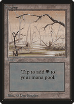|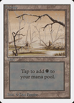|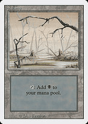|
|Limited Edition Alpha|Limited Edition Beta|Unlimited Edition|Revised Edition|
|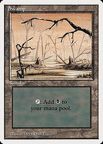|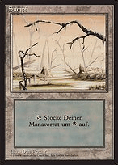|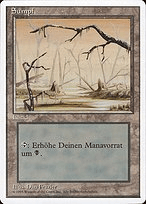|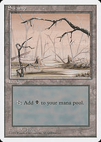|
|Summer Magic / Edgar|Foreign Black Border|Revised Edition<br>(Foreign White-Bordered)|Fourth Edition|
|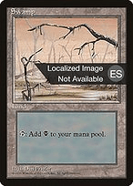|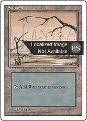|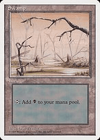|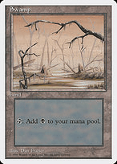|
|Fourth Edition<br>Foreign Black Border|Fourth Edition<br>(white border print run)|Rivals Quick Start Set|Introductory Two-Player Set|

[^upright]: This is only a single Swamp illustration. Alpha contained two different illustrations, and Beta added a third. This is "Version B", or "Upright Branch Version", or card 291, depending on who you ask.

There are also a few additional sets, which are special prints with gold borders, and a different back print on the cards. All of these cards are not legal to play, easily recognized, and not worth mentioning here. Of course, the illustration on the front is exactly the same again, but you'll never be confused about the origin of these specific prints.

There's still yet another print run though. The "Fourth Edition Alternate" is similar to the experimental print run "Edgar" of the **Revised Edition**. However, Edgar actually has distinct misprints that appear only in that print run, giving it the honor of being treated as a distinct set. The "Fourth Edition Alternate" has no such luck. The cards are recognizable from the distinct SKU/ISBN on the box, or also the cards reaction to UV light. Both Edgar, and Fourth Edition Alternate have light emitting properties not present in any other print run. While Edgar was only printed in English, the Fourth Edition Alternate was sold in multiple languages.

So, what is a unique print? I was able to rely on great collectors before me. [The Green Disenchant Project](https://greendisenchantproject.jimdofree.com/about-1/) is at the top of the list, when it comes to defining prints. It also opened my eyes to the "Artist Proof", which is a print for the illustration artist, to determine if the colors came out right. A full sheet of printed cards includes non-playing cards, so called "Filler" cards. There are play-test cards. And then there is the entire unmeasurable dimension of _misprints_! [The list goes on, and on](https://www.magiclibrarities.net/rarities.html)...

### Languages

Luckily, sets are consistent between languages. For the card in a foreign language to be counted towards the set, it must have appeared in a release with a card list of a specific edition. Thus, we can infer that a given set, in a given language, contains all of the cards of the same set in any other released language.

I assumed that this was obvious, but was surprised pretty early on, that some cards on Scryfall were shown to be only available in a subset of the languages of the general release.

Because I already knew of some cards within sets being treated specially depending on their language, and some cards only being available in a single language, I just assumed that this pattern was more widespread than I could understand without owning more cards.

We will get back to this.

### Foils

In 1999, we got the first foil cards. Foil cards have a print layer with metallic particles, which cause light to reflect in a way that you see spectral colors on the card. It should go without saying that anything _that_ shiny is obviously dramatically more valuable than a non-shiny counterpart. I ignored the specifics of foil cards for too long, and then resisted to properly normalize all my data according to my learnings, but here we go.

The most important thing to know is:

1. Some prints are _only_ available as foils.
1. Some prints are _not_ available as foils.
1. Some prints are available in a regular, non-foil version, and a foil version.

But let's take a closer look. We started seeing foil cards in booster packs for **Urza's Legacy**. Basic land foils were also in the Arena League 1999 promo. At the time, Collector Numbers were already printed on the front of the cards. Foil cards got an additional shooting star over the artist name (which was centered horizontally at the time). In later editions, foil cards were actually assigned their own, distinct collector number with a ★ suffix.

Another component in the mix is that some illustrations appear in multiple foil variants within the same set. So you have a single illustration in a regular, non-foil version, the standard foil version, and a promotional, special foil version with a distinct collector number. The latter is a distinct print _only_ available as a foil. It is technically unrelated to the other two prints, even though it uses the same illustration as a foundation.

### Micro Observations

So some cards only differ on a microscopic level? What does that mean? I couldn't really make sense of the guidance material I found in other online sources, and decided I should do my original research.

Let's call this `Sample DE.371 NEUTRAL`:

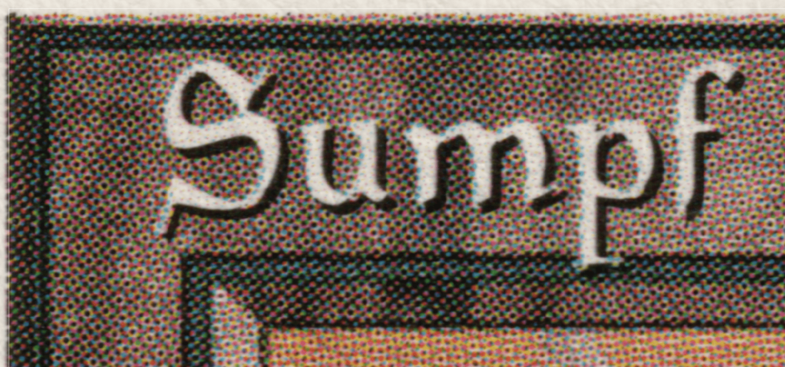

This card was scanned at 4800 dpi, which produces a 750 MB uncompressed bitmap spanning 12,000 by 16,700 pixels. Scans take about 20 minutes to complete. After that, the image has to be rotated into a neutral position, and anything that _can_ be cropped off, must be cropped off. Everything that can reduce further processing load, must be applied as early as possible. If you can see it, take note of the thin white guide line, marking the outer bounds of the print area in the reference frame.

At this magnification, there are no straight lines. There are only patterns of black dots, and every tiny movement of the print head can make the line deviate from a straight path. Cards themselves are nowhere near straight anywhere. First of all, the illustration within the white border does not have the same orientation as the cut of the card. In hindsight, this is obvious, because they first print an entire sheet, then cut the cards from the sheet, and then mint them in the corner cutter. Perfectly aligning the cards, so that the cut would be exactly parallel to the illustration, would be ridiculously difficult.

I normalized all my samples by running a guide through the single horizontal black line pattern under the illustration, aiming for the guide to run through the middle of the ends of the line pattern. It's not uncommon for the black line to fully leave the guide at some locations over the span of the card. Using the corners seemed like a reasonable average. This process has to be done extremely carefully, because the slightest mistake in rotation will cause misalignment at the important corners of the card. Adjustments of +/-0.01° in rotation are a common precision.[^rotation]

[^rotation]: If you rotate a 1 meter long stick around one end by 0.01 degrees, the other end of the stick would move 0.1745 mm.

Now we'll look at `Sample DE.371 XL0`:

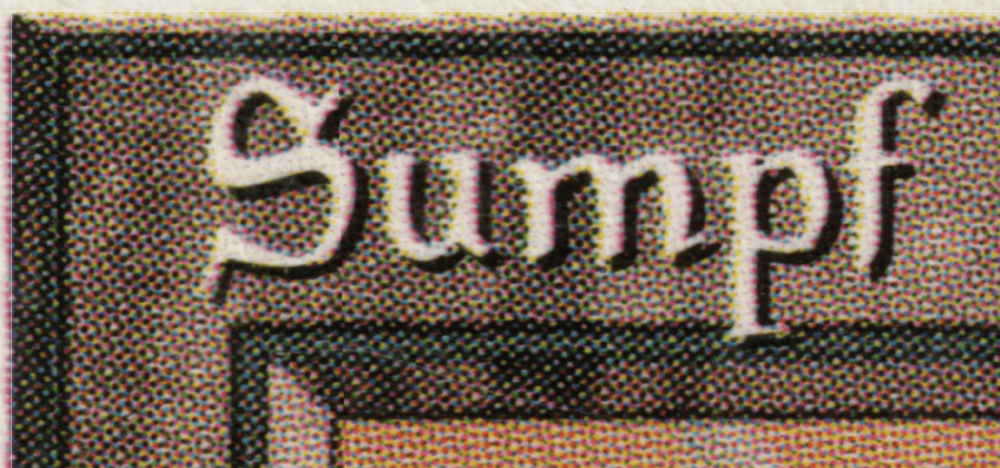

Some general observations, that play _no role at all_ in actually identifying cards:

1.	We can see the Yellow dots of the print sticking out further at the top, compared to `Sample DE.371 NEUTRAL`. This can indicate a different position on a print sheet, because only one of the CMY print heads can be the first one to print in a given direction.

1.	The card seems to exhibit a different Rosette Pattern[^rosette], compared to `Sample DE.371 NEUTRAL`. This can indicate a different printer being in use.

1.	The color bleeding inside the letters is clearly different. `Sample DE.371 NEUTRAL` has Cyan bleeding into the left of letters, `Sample DE.371 XL0` has Magenta bleeding in from the right. To the naked eye, this can result in serifs appearing slightly differently.

But the _really_ keen observer might have noticed something else. There is a big, fat chunk of pixels missing RIGHT THERE running from the top of the card through the right edge of the `S`, all the way down to the end of the scan. What the fuck?

[^rosette]: When you look at these cards real close, or with large outdoor advertisements, you can see the individual color dots running over the surface. You might notice some regular patterns, forming floral shapes. These flower shapes are not random, and don't happen accidentally. There are a few [industry-standard rosette patterns](https://en.wikipedia.org/wiki/Halftone) used in all of printing.

#### The "Why am I Missing Pixels in My Scan?" Problem

Words can not express the thrill of creating a 4800 dpi scan of the full length of your scanner bed, with the goal to look for microscopic faults, and then Xsane crashing on rendering the bitmap into the target file format. This happened more than once. Generating the material for this research, with all the processing involved before I could even think about analysis, took several days.

When I first became aware of these errors in the image, I was surprised to learn that this is a somewhat well known issue. Here are some noteworthy mentions:

- [Missing lines at regular intervals in flatbed scanners. Can it be avoided or solved?](https://photo.stackexchange.com/questions/134946/missing-lines-at-regular-intervals-in-flatbed-scanners-can-it-be-avoided-or-sol)
- [CanoScan LiDE 400 broken lines](https://community.usa.canon.com/t5/Scanners/CanoScan-LiDE-400-broken-lines/td-p/487637)
- [Artist Review: Canon LiDE 400 flatbed scanner](https://www.parkablogs.com/picture/artist-review-canon-lide-400-flatbed-scanner)

Most importantly, none of the mentions I found have any clue regarding what is going on here. I assume this to be very hard to explain, and the best you can expect is that you can return the item and get your money back. Of course, this is not an option for me. I have to know.

I was sure very quickly that this must be a hardware-, or driver-level induced fault. To check of the easy cases, I repeated test scenarios with different software, different tool stacks, different driver interfaces. I methodically expanded the scan area in width, or height, or both, changed the rotation of cards, to see how that would impact the position of the fault line. It became clear that the lines are in a fixed position and orientation in all scans, completely independent from any changed parameter.

Because it was also clear that the lines are running along the movement axis of the scan head, I covered the scan bed width with cards, to analyze the full width of the scan head. After marking _all_ of the fault lines in the scanned image, I got this result:

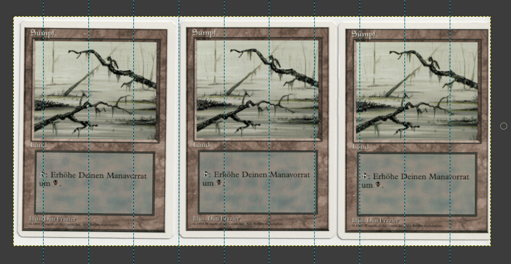

This is where I left it, because it appeared highly reasonable to me that the scan head is made up of individual, chained sensor components. At the location where two sensor (casings) touch, we lose 2 pixels. Each segment in this scan is exactly 3456 pixels wide. Let's math around a bit!

We scan at 4800 dpi. So every inch of card we scan, should give us 4800 pixels. A Magic card is 2.5 inches wide, giving us 12,000 pixels. When we scan cards in the orientation shown above, with the lines running from the top of the card to the bottom, each card is crossed 3 times in the best, 4 times in the worst case. If you scan the card rotated by 90°, it is crossed more often.

2.5 inches equal 63.5 mm. Dividing 63.5 mm by our 12,000 pixels, tells us that each pixel is ~0.005291667 mm, or 5.291667 µm.

`Sample DE.371 NEUTRAL` is a sample that was scanned at 90° rotation to fit the entire top of the card into a frame without fault lines. That's why it's _neutral_. `Sample DE.371 XL0` is the first sample in the set with data loss on the X-axis.

Assuming that we lose 2 pixels at a fault line, this is a loss of 10.6 µm.

#### Why This Matters

Here is `Sample DE.371 XL1`:

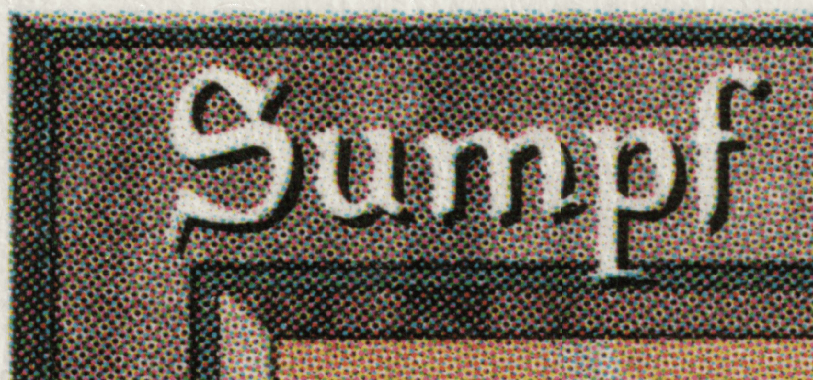

Notice the fault line running through the right-most part of the `m`. All samples relevant for this case are `XL` samples, because we care about differences in vertical positioning between the Foreign White-Bordered Edition and the 4th Edition of Swamp cards. To help with that, let's add some guides to the images of `Sample DE.371 XL0` and `Sample DE.371 XL1`.


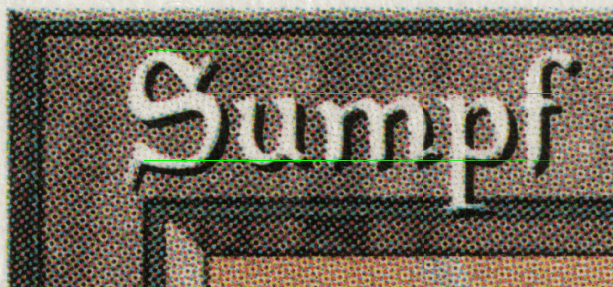

The thin green lines are in the exact same position in both samples, as they are part of the reference frame. You might find it hard to believe that _this_ shows the difference we're looking for. I aligned 12 samples for hours, before I was satisfied. Every transformation on these large bitmaps results in watching a progress bar. In the final sample set, you can turn individual samples' visibility on and off to see the entire print pattern shift around wildly, with all key positions and alignments staying highly consistent. Except for when they don't.

We're really looking for this very tiny amount of difference in the vertical alignment. The most distinct differences are the bottom of the `S` and `u`, top of the `p` and its bottom-most serif, and middle stroke of the `f`. By measuring the distance between individual color component dots, we can easily infer that the Magic card was printed at 150 dpi. The placement of each dot has a significance on the overall shape of letters, and how their position appears.

At 150 dpi, you have 6.25 dots per mm. So every dot introduces a variance of 160 µm. The actual vertical offset between these two samples is 100 µm. So, which is which, and how do I know?

The one with the lower text is Foreign White-Bordered, the one with the higher text is Fourth Edition. To establish that, I first sorted all cards into groups depending on wether they have [the black dot on the back](https://greendisenchantproject.jimdofree.com/dot-print-variants/). Given that I was sampling German Swamps, cards without the black dot on the back, are known to be from Fourth Edition. These samples were used to construct the reference frame.

#### Why it Actually Doesn't Matter at All

Even in collector circles, both cards are worth about 0.10 €. Nobody gives a single fuck if you own either card. Most people won't even know all this back story to be able to care even the tiniest bit. With a rare card, of course people would go the extra mile to verify it's the real thing, but these two cards are worthless.

### So How Many Prints are There?

Once I had really taken into account _everything_, I ended up with a target card count of **roughly 6,000 cards** (still wrong). However, I already had a small stack of Swamp cards that had no entry on Scryfall. Often, none of the Swamps were even in the set in that language. It turned out that the Scryfall information is a copy from Gatherer[gatherer], which is just missing a lot of foreign entries for cards at the ends of the set list, which are usually the lands.

After scoping this issue briefly, it became clear that there are large areas of completely unmapped lands. For some sets, only the English version is listed, even though the entire set was released in 7 other languages. In a set with 4 illustrations, that's 28 cards. With foils, that's 56 cards.

I still don't know the final count, but I assume it will be **between 7,000 and 8,000 unique prints**.

## Ultra-Rare Cards

Do you know what a [Black Lotus] is? Maybe heard of [Time Walk]? Or the "Double Lands", like [Underground Sea]? Pretty crazy expensive cards, right? Sure, not every card in the game is worth that much money, but the cards obviously are all generally valuable items, for which there is a market. Even a Guru Land Swamp, or a Swamp from Edgar go for 500€. Wouldn't it be great to own those shiny items?

And then what? Write a blog post about it? Put the case under my pillow to unlock new dimensions of dreaming? Hoard the thin piece of cardboard until I die? Well, maybe I can find the answer later, _after_ I purchased the thing. It's not like a Black Lotus is going to _decrease_ in value. I can just resell it anytime, in case I change my mind! Right?

No! Nobody cares! There is no queue of people lined up waiting to stuff 50,000 € into my pocket to buy my card. There _might_ be people to buy it, if I give them a great deal. But even if I offer my 50K Lotus for cheap to a large reseller with plenty of cash, you think they're waiting on spending that much cash on a single stock item, when they could be purchasing hundreds of booster packs with that money? You think there is some rich person who is just waiting to burn money, and they are waiting specifically for _my_ offer on the market, instead of buying any other offer?

Also, how naive is this idea, that I'm just going to put an item like that up for sale online? And then what? Someone from overseas purchases my 50K card, and then I just stuff it into a box and FedEx it over? What if they claim they didn't receive it?

With every collection, once you get a bit into the markets, it basically becomes a purchasing game. It's not like you actually have to go on a big hunt in the world, you just have to spend money online. Whatever initially appears like the crazy-rare, hard-to-get mindblower, turns out to be just another marketplace item collecting dust. You can have it easily, it's right there. But once you have it, you better love it as much as 50,000 €, because you will never see those again.

And all of this _should_ be so obvious. You can't buy _anything_, and then sell it back to the seller at zero cost. It just doesn't work like that. The store window price is not representative of the value of the item in my ownership. It never is. This is really important, because...

## Ultra-Common Cards

I'm not collecting Lotuses here. I'm collecting thousands of fully equivalent cards with exactly the same gameplay value as any of their current-date release counterparts. Sure, foil lands are great, but nobody is going to buy one from 15 years ago, for the price of one or more fresh booster packs.

Most importantly with these cheap cards, you're never buying just the card. You're also buying the shipping service to have the card arrive at your door. You might be missing a Swamp that is traded at 0,02 €, even in mint condition, but you still have to pay 1,80 € postage. That's 90x the cost of the card. If the card increases in value 10x, you can resell it for 0,20 €, but postage is due again. Now on to sell the remaining 7,999 cards.

Even when I wanted to believe that there will surely be other collectors who would gladly take the collection off my hands one day, this was shattered by experience. I've been watching some really nice land collections on eBay for months now. I thought they were a pretty great deal, and they are, but am I going to pay 1,000 € for a big box of lands? I guess I should, because it would ultimately be cheaper, but I don't just want to have a full collection by buying it from someone else. And nobody else is buying the offer either. Maybe someone will, once the asking price gets below 10% of the assumed market value.

So even the other potential buyers, who are as crazy as I am, and who want _all the lands_, don't want to just wire one dude the full worth of his collection, so he can ship it over in a single go. That's not collecting.

## Counterfeit Cards

I don't think anyone ever tried to scam me with a counterfeit basic land, but I really don't check for it. But I have certainly ordered my fair share of counterfeits intentionally. And I really went all out. I had stacks of counterfeits, before I purchased the first original on an official market. And these copies _look so fucking real_!

If you ever wanted to see what it feels like to rip a Black Lotus in half, starting with a counterfeit is a reasonable substitute. It really fucks with my head.

But don't believe for a single second that anyone would ever mistake that counterfeit for an original. Not a single item I got, is even remotely close. It's not like people will have to put the card under a microscope and analyze it for hours to come up with a "maybe this is fake". All of these cards are clearly fakes, after seconds of inspection.

And there is so much weird information about detecting fakes. People talk about how counterfeits _feel_ wrong, or that the surface finish is too shiny, or whatever. You don't even have to touch the card to know it's fake.

Once you look at any card with a loupe, you don't even have to start searching for the details. It is just all wrong.

I don't want to repeat creating the same material that others have already published many times. If you want to see the details about counterfeit detection, <https://www.mtginformation.com/counterfeits> has a clear, brief overview.

## Purchasing

1.8 million years ago, _Homo erectus_ started to establish hunter-gatherer lifestyles. This means that half the population went on a hunt for food, while the others, the gatherers, traded Magic: The Gathering cards. This is so deeply ingrained in our DNA, that our brains have reward systems that trigger when we put a foil card into our collection. Because life depended on the success rate of your efforts, there is a natural drive to optimize acquisition strategies even today. We don't collect, because we want to eat the cards. We collect, because we like the acquisition, all the problems that come along with it, and then solving all of them. Just because someone traded their gathered foil Plains for a few Birds of Paradise that a hunter brought to the cave a million years ago.

So let's look at all the ways (so far) I stupidly burned money. Ordered worst to best.

### Amazon Boosters

Booster packs are gambling for kids. As an adult, it's easy to forget the time when you didn't have a credit card, and lived on your allowance. I'm not sure how it is with kids today, but I assume global online purchasing is still radically easier with MasterCard and English language skills.

Last time I opened a booster is 25 years ago. Buying a few boosters, to see where it's at today, is reasonable. Buying them from Amazon is questionable. The boosters on the trading card markets are exactly the same units, but at a lower price. You'll also be supporting small businesses, the community, and all that good stuff.

Opening booster packs has added 1 Forest to my land collection so far. That's it.

### Market Land Lots (mixed/unmixed)

If you're trying to burn money at scale, this is the choice to go for. I actually welcome duplicates in my collection, but these offers are usually the result from large resellers opening stacks of booster or bundle pack boxes. This is how they fill up their inventory. New set comes out? Let's open enough boxes until we can offer a couple of complete sets, foil sets, rare sets, and so on. They end up with thousands of lands, all from the same edition. This is what you will get.

Market sellers will often also sell their offers on eBay. This makes no difference. If the cards are all near mint, this is where they are from.

Some sellers will also buy bulk, and sell the scraps after sorting. I haven't seen this stuff on markets. It usually goes back on to eBay.

Buying Market Land Lots resulted in owning more than 200 copies of a single Swamp card. 50 copies is not uncommon.

### Market Singles

These deals are as fair as they get. If you're looking for a single, this is the way to purchase it. But we're not making much progress focusing on singles, and we're paying insane amounts for shipping. I want as much money to be converted to cards as possible, and not waste most of it on logistics.

It took me some time to really understand how to use the market platforms properly. I spent a lot of time trying to get my purchase lists registered, to then search for offers on those cards in bulk. This is all wrong.

To overcome this, I had to enable myself for chaotic management first. This will be covered later. Now I purchase by source. I look for a seller with a good offer on one item, and then search their entire inventory for any other card I need, and buy all of them. Then I get my 1 card I was looking for, a bunch of cards I didn't really need right now, and I've burned another month's budget. But the bottom line is dramatically better with this approach.

### eBay Bulk

Most eBay offers with bulk cards are fake. It's always the same photos, same bullshit stories, same `charlie023457` accounts. The story is always some of this crap:

- "My son left these here ages ago. He no longer cares."
- "These belonged to my ex-boyfriend. I have no idea what this is."
- "I'm not sure if anything valuable is in there, but some of the cards are shiny."

And then you look at the 7 reviews they had so far, and they were for exactly the same offer. These are all sockpuppet accounts, selling recycled bulk.

Don't get me wrong, the offers are not _scams_. You get real cards, exactly as described, perfectly usable condition. It's just that the story is fake to make you think there could be hidden treasure in the box. There isn't. Also be aware that these offers usually don't include any lands.

Rule of thumb: If the offer has lands, it's a private collection. No lands = recycling.

That being said, one of the most expensive cards in my collection is a [Rhystic Study](https://scryfall.com/card/pcy/45/rhystic-study) I pulled from an eBay bulk lot. And sorting bulk can be a nice past time.

### Random eBay Land lots

Sometimes players will sell off sets of lands, where you can get a couple dozen versions in one strike. _Player_ commonly implies _played_ cards. This type of seller will commonly overvalue their product, and grade in their favor, if they grade at all. This matters.

If I see such an offer, I check the market value for the offered items. The market value will usually reflect a near mint version of the item. Obviously, I only want to buy below market value anyway. Otherwise I could just buy the offer where I just looked up the market price. If I now receive a played card, slightly cheaper than a near mint version, but still overpriced for a played card, I gambled on the purchase.

Now I calculate my fair price, with a safety margin, place that max bid, and never increase. Takes practice to not let the eBay app fuck with your mindset.

### Market Land Sets

By only collecting a single land type, I really made things a lot harder on myself. One of the classic trade units is the _land set_. There are different varieties, but it's generally a set of all the lands in a release. If a seller offers multiple different versions, this can easily fill entire areas of the collection in a single go. This approach is particularly successful with recent releases.

But we just arrived at potentially 8,000 cards?! Are we talking about 40,000 now?!!

## Storage

Let's look back at the old portfolio binder first, to see where I'm coming from.

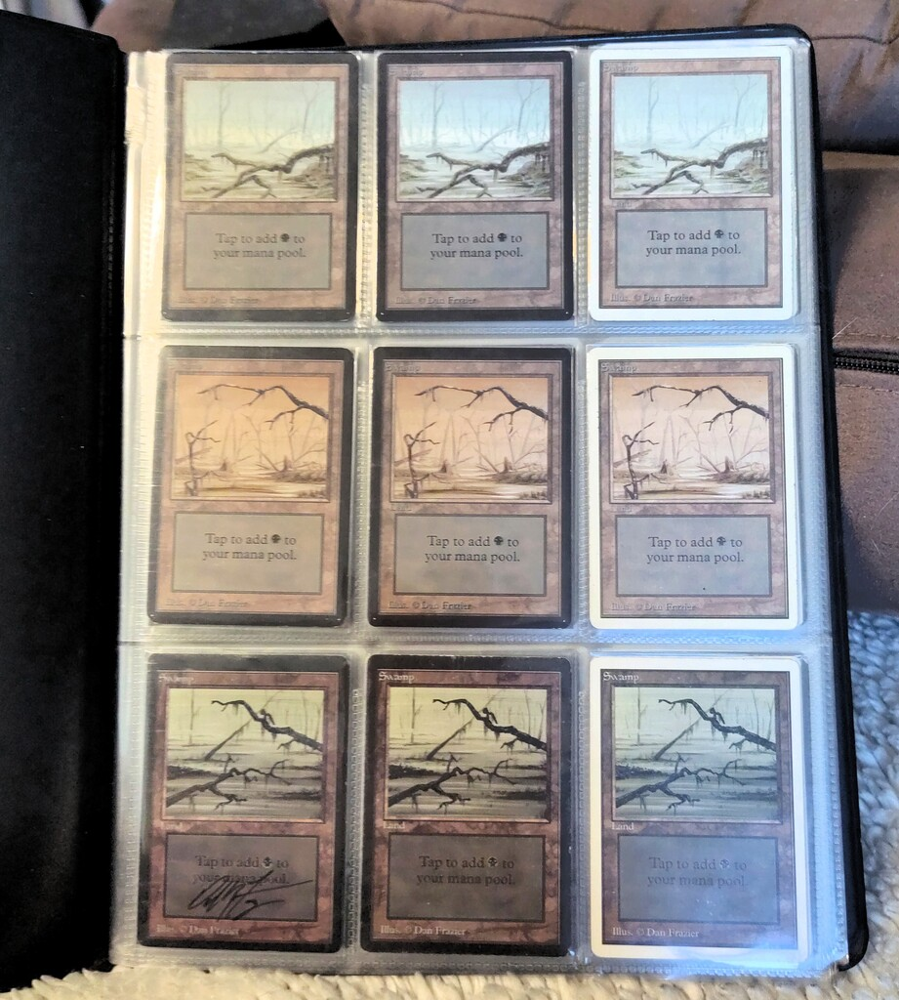

The first page has Limited Edition Alpha, Limited Edition Beta, and Unlimited Edition. So, _this_ is the solution to those pesky empty slots in the layout: Fill them with autographed cards! The bottom-left slot is another Swamp from Limited Edition Beta, as Limited Edition Alpha only had 2 illustrations per basic land type.

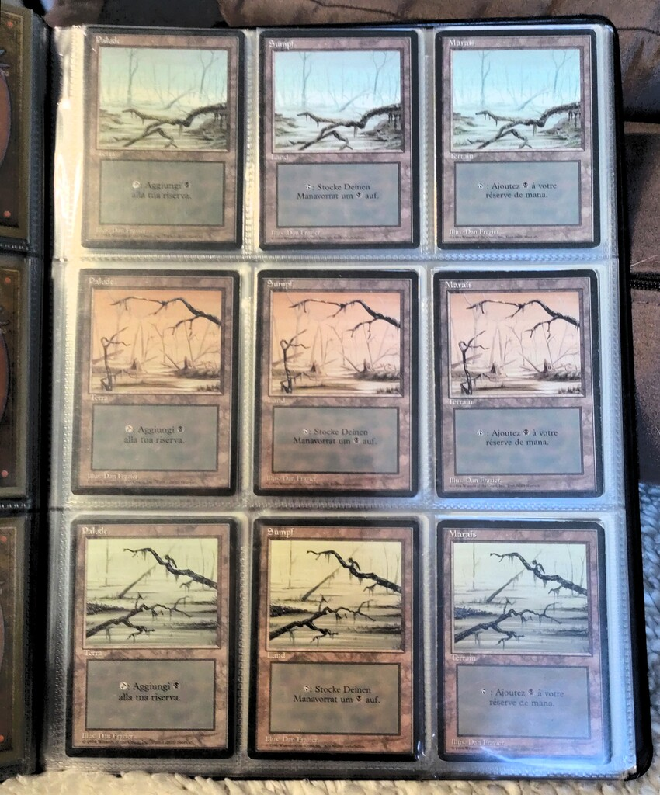

On this Foreign Black Border page, notice the differences in the _Tap_ Symbol. Remember that the Foreign Black Border prints are the first foreign prints of the Revised Edition. The Italian version (Edizione Italiana) in the first column still uses the symbol from the English print of the Revised Edition.

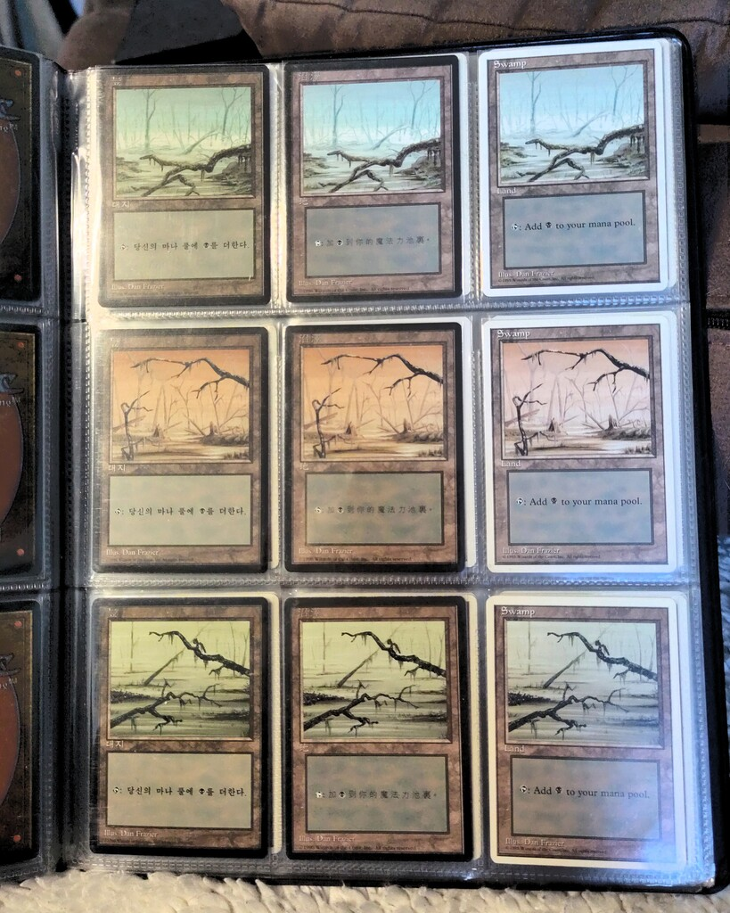

Here we have some Fourth Edition. It's not easy to make out in this photo, but two of the Chinese Swamps (middle column) have a slightly different Tap Symbol than the center one.

All the pages are only filled one-sided. Commonly, you would put 2 cards into each slot. One facing the front, one facing the back. That's why this 10-page binder only holds 90 cards, not the 180 that you might expect. Given the Collectors Edition cards in the collection, I also wanted to see the back of all cards.

That binder definitely came out exactly as I hoped it would. It's just a pleasure to flip through the pages. But this does not scale to thousands of cards.

### Ingest

Storage challenges start at the ingest of newly received card packages. These packages need to be processed according to their source. eBay purchases should receive seller feedback, and order clearance on the web UI for decluttering. Market purchases require arrival confirmation, and shipment evaluation.

When it's clear which package belongs to which order, the contents are evaluated first of all for completeness, in case anything needs to be resolved quickly. Then market purchases are quickly checked for drastic mistakes in grading. After this, the workload is considered consumed, without any further need for callbacks to the seller. The workload is stashed.

Whenever I get to it, I grab an "ingestion tray" to process the cards further.

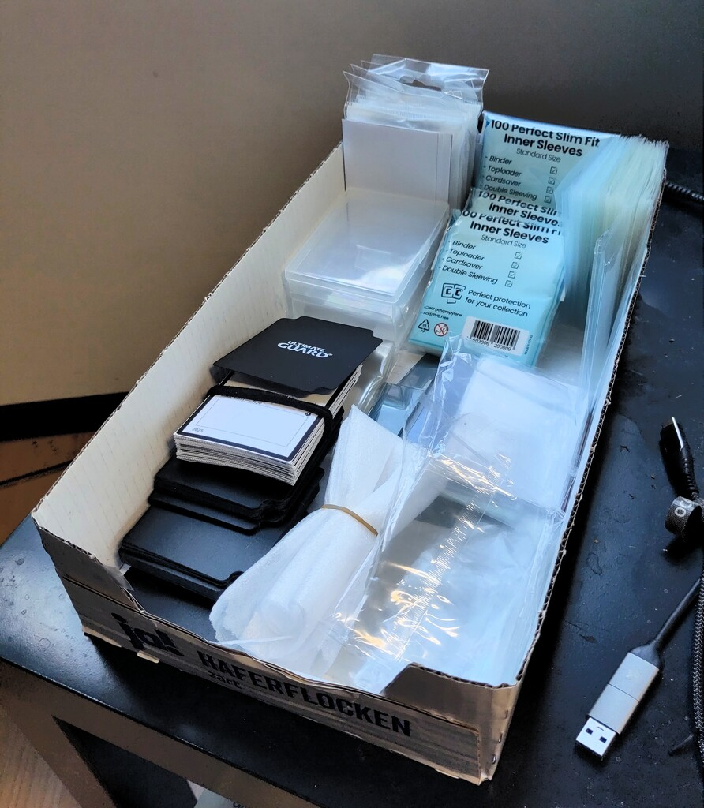

For unsorted/mixed loads, I start with card identification, and pre-selection. All cards that clearly go into the collection are sleeved right away. In bulk loads, most cards remain unsleeved. All the different wrappers and other penny sleeves are for card scraps when sorting. There generally is a constant need to pile and organize smaller stacks during ingest. The sorted, and sleeved cards, go into another cache which often looks like this:

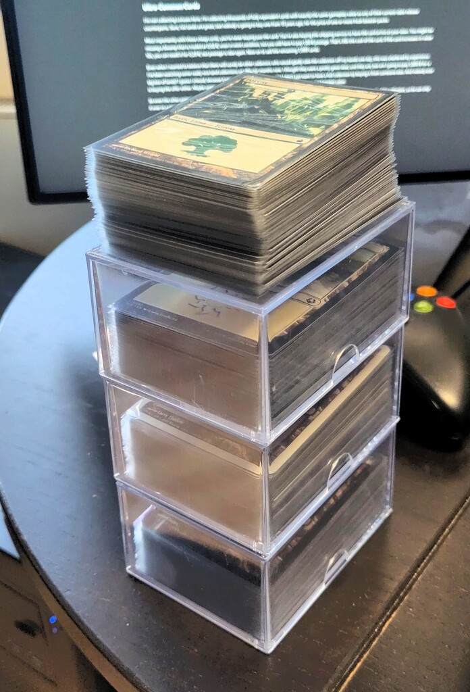

This is where I commonly register the cards fully in Landrush, before dropping them into their final at-rest storage location.

### Sleeves

Let's quickly look at card sleeves. All cards in the Landrush collection are sleeved with **TCG Guru Perfect Slim Fit Inner Sleeves**. I've purchased a variety of sleeves, to better understand what is what.

#### Matte Sleeves

These are imprinted with a surface pattern, to scatter light reflection. I find these very comfortable to handle, but the extra production step makes them slightly more expensive.

#### Penny Sleeves

Generally means a pack of 100 sleeves, costing 1 USD. In my experience, implies **soft outer sleeve**.

#### Soft Sleeves

They are _soft_, because the plastic is thin. In my experience, always **outer sleeve** sized. Also commonly used to fit multiple cards into a sleeve during transport.

#### Inner Sleeve / Double Sleeving

An inner sleeve is supposed to wrap the card, and then fit into a second sleeve - the outer sleeve. Some manufacturers seem to design their inner sleeves to perfectly match their own brand outer sleeves. They might even advertise this, looking like a feature. Sadly, in my experience, this can mean the inner sleeve doesn't fit into a binder sheet, or your off-brand outer sleeves.

#### (Outer) Sleeve

Sleeves that are not declared otherwise, are expected to be outer sleeves. They have enough empty space, so that an unsleeved card can shift horizontally. These sleeves are often colored, or have elaborate prints on the back. A player will wrap their deck of cards uniformly with these sleeves, to protect them during play, and prevent cards from getting into question for being marked.

With some brands, the outer sleeves did not fit into UltraPro 3x3 Clear Binder Sheets.

#### Side-Loading

You generally don't want to have unsleeved cards in your binders, because any movement of the card within the binder sheet can cause scratches on the card's surface, decreasing its value. A card is usually sleeved with the sleeve opening on the bottom. When it is inserted into a binder sheet from the top, this leaves no cardboard surface uncovered. This is the same double-seal that is expected from, and achieved by, double sleeving.

If you look back up at the old portfolio binder, it has the opening, to slide the card in, at the top. Especially if you fill it with only a single card per slot, maybe even unsleeved, you can easily shake out all of the cards from the binder. There are other binders, where you slide the cards in from the binding outwards. So the only way the cards could slide out, is towards the fold. This also provides a larger opening for the cards to slide into, which can increase comfort.

When you side-load a binder, you probably also want to use side-load sleeves, to achieve the same double sleeving double-seal.

#### Toploader

A much more durable storage unit to easily fit cards already in outer sleeves. Doesn't hurt to stick expensive singles into one of these, but they are particularly useful during shipping. However, the majority of received packages simply use rigid cardboard for protection.

#### Hard Cases / Bricks

Rigid enclosure, intended for a single card. Sometimes engineered to very fine tolerances, so that **only** unsleeved cards will fit inside. Attempts to squeeze a sleeved card in there, will damage the card. Versions specifically intended for sleeved cards exist.

Large varieties of depths available, due to the full scope of the trading card market. Magic cards are 35pt thick. If you're wondering about the larger cases with hundreds of pt thickness, those are for sports cards with embedded fabric patches or wood, cut from player's equipment.

#### Slim Fit

This really only makes sense with **inner sleeves**, and means that the sleeve will have an extra tight fit around the horizontal axis of the card. When I was browsing available products initially, this was extremely confusing to me. How many different fits can there be?

Sleeves are made by machines, which have tolerances from wear and operation speed. A cheap production can result in sleeves that are not uniform even within a single production run. If multiple machines are operated simultaneously, they might produce inconsistent results. It's always safer to produce a sleeve with a bit of extra room, than to produce one where no card could ever fit inside.

If a sleeve is declared **slim fit**, I expect it to be produced to a quality standard that the manufacturer can guarantee a nearly perfect fit onto the card. I can commonly fit such a sleeved card into a non-slim-fit sleeve, which then fits into an outer sleeve. Triple-sleeving was not invented here.

#### Sleeve Wisdom

Products that are commonly offered and sold in bulk are a good default choice. People who buy 1000 sleeves don't mess around. Consistency is key. You don't want to open a pack of new sleeves and suddenly have them be a slightly different size.

Sleeves are longer than cards. I was looking for some that would also perfectly slim-fit along the height of the card, because I figured it would look better, but that was misguided. You don't want the edge of the card exposed at all. Having one side of the sleeve open is kind of a requirement to make it useful, so that's what we have to accept. So we double-sleeve the precious cards. If moisture were to accumulate in the outer sleeve, at the exposed edge of the card, we would not like that. The extra lip on the sleeve provides extra distance from any outer sleeve to further protect the card. It also sometimes centers the card in the outer sleeve.

Getting a card into a slim fit sleeve can be annoying. If you have to do it thousands of times, you even think about that. You will easily find people discussing the risk of damage to a card that results from different insertion techniques. One fine detail stood out to me:

We hold the sleeve between thumb and index finger near the opening of the sleeve, then we rub our fingers against each other to open the sleeve, and while sliding the card inside, we allow the opening to close around the card, so that the other corner of the card can ultimately slide inside the sleeve. Great.

The way I was doing it initially, would crease the sleeve, because I was opening it so wide that the foil on the front was no longer just bent. This leaves a permanent nick on the front and back of the sleeve. It's not the worst thing, but you might as well do it proper.

### Boxes

Sleeved cards, which have been registered in Landrush, are then moved into long-term storage in boxes.

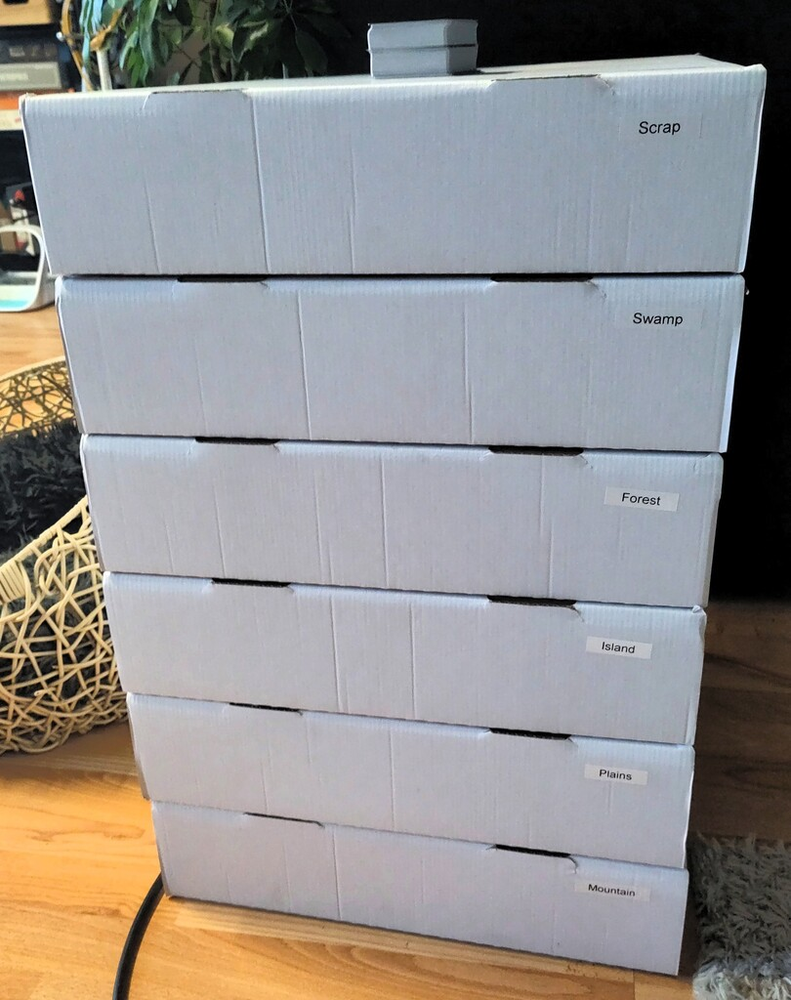

These are the same boxes you will constantly see in eBay bulk offers. Nothing says "big, fat, load of cards" like these boxes. They are advertised to hold 5,000 cards each, and they deliver that. On top of the boxes, sits a stack of 120 cards, waiting to be archived.

If you remember earlier total estimates, maybe 8,000 cards per land type, this is obviously not enough storage. To be continued.

### Divider

Dumping everything into a box is great, but without being able to find a card again, it's just another garbage dump to hide the spending sins. Before I even ordered the boxes, I had clear plans of how the card management should work. I placed a very high importance on cheap, easily reproducible, dividers. Let's look inside the box.

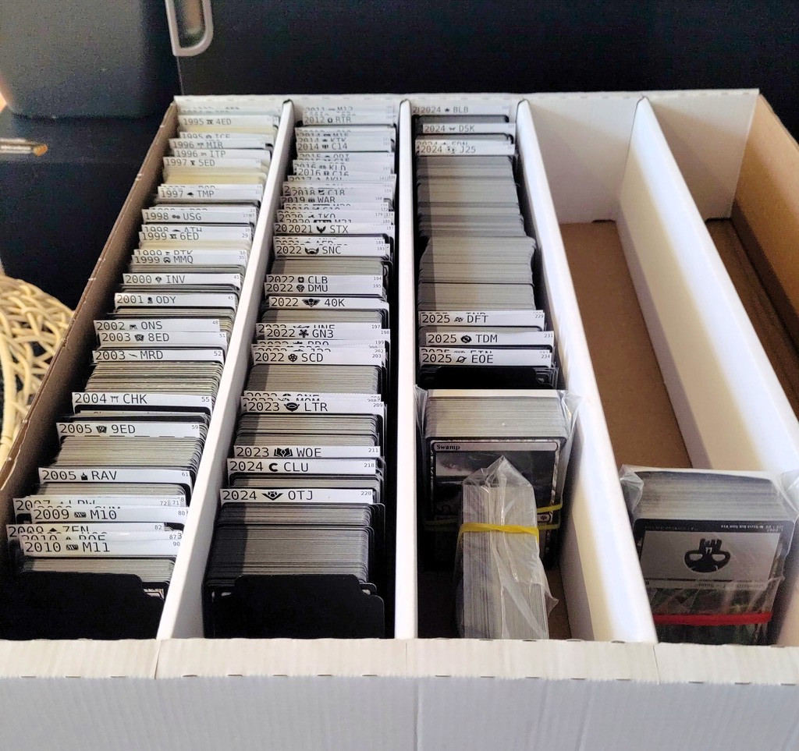

To get that out of the way, the plastic-wrapped packs are 100 copies of a single card each. The start and end of a column is protected with an Ultimate Guard divider, as the column of cards often needs to be moved, and I found myself clawing at cards too frequently. I originally purchased them to evaluate them as dividers between all sets, but that was underwhelming.

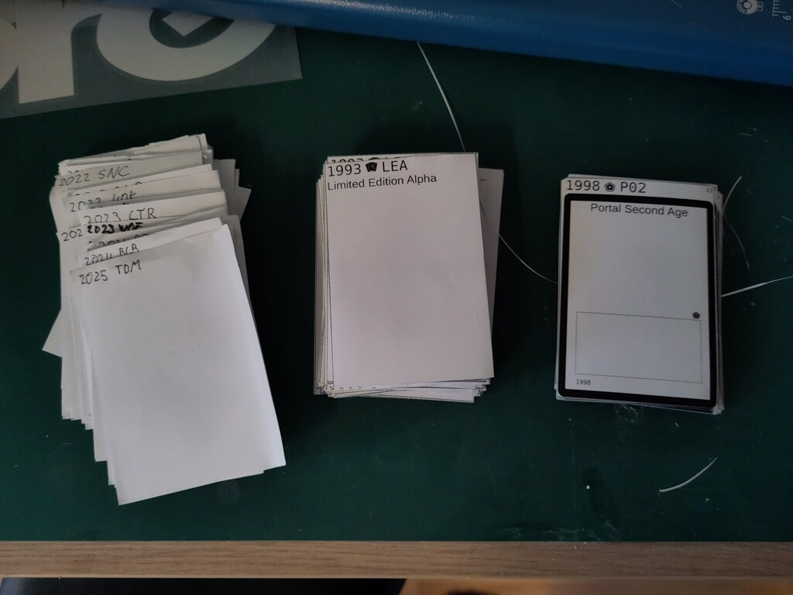

My first approach was just cutting A4 sheets of paper into 9 pieces roughly the same size, and then writing on the lip by hand. The results worked exactly as intended, and were a great tool to fully understand the problem space.

Cutting with scissors by hand is bad. The cuts are never properly straight, and the resulting shapes vary greatly. A lever cutter was the first upgrade. Now all cuts were straight, but due to imprecise measurement, the results still varied noticeably in size.

Once I got a laser printer into the mix, I could start to fully design the solution that would allow more progress. This is part of a fairly recent revision:

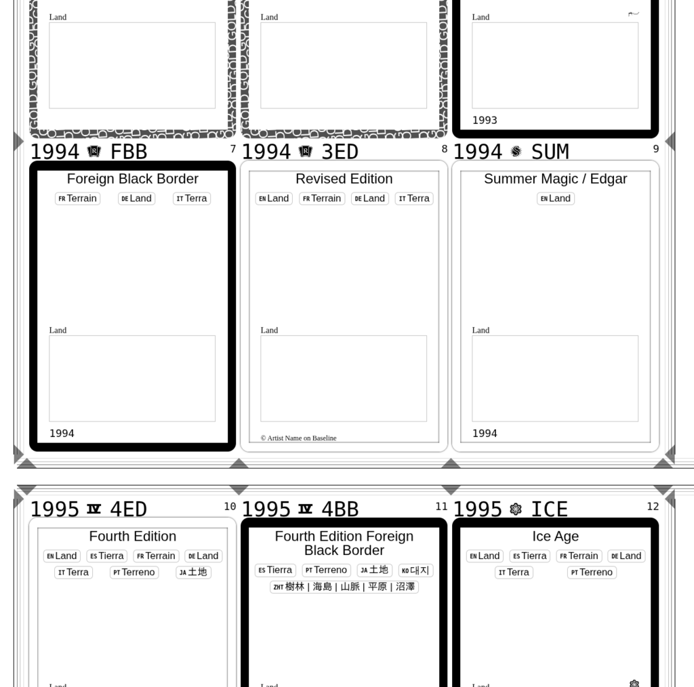

I'll try to sum up the most important features and learnings:

1.	Dividers must have the exact same width as cards. If they are slightly wider, they tend to wrap around the stack and come out of alignment. If they are thinner, they come out of alignment by-design. Thinner dividers also tend to tipping.

1.	Dividers are as high as cards, with a consistently long lip, to fit the release year, set icon, and set code at consistent positions. All further information is fully hidden behind the actual cards.

1.	Dividers have a consistent index at the top right corner. This feature suffers from all off-by-one bugs that you would expect from implementing an incremental index. I anticipated this, and decided it would encourage iteration, and could be forgiven this one time. It certainly did provide plenty of opportunities for iteration.

1.	To help with in-situ card identification, the divider indicates certain features found on cards of that set. All of these require fixes all the time.

	- Color of the border
	- The type line used to say "Land" and was later changed to "Basic Land - Swamp". So the appropriate type line is shown on the divider.
	- Expansion symbol
	- Year of the US (or primary foreign market) release, if it was printed on the card.
	- Copyright position, to distinguish Revised from Unlimited prints.
	- The languages the set was printed in, with the appropriate language sample, to aid identification of foreign scripts.

	There is no shortage of ideas for additional features.

1.	Cut alignment indicators in the margin, instead of the dotted grid around all dividers, which I used until recently. You can see the fragments of this approach in the middle stack of dividers in the photo above. I tried a lot of different ways to optimize the behavior of these cut lines, before I realized that they are entirely counter-productive. The current design is still actively being refined to optimize for the physically printable area of the paper.

And, yes, the very first thing I did with the proof of concept generator, was to print and cut a full set of 1000+ dividers for all sets ever released. Swamps are in 215 of those sets. Adding a filter to only generate the sheets for the sets with basic lands, provided roughly a 500% increase in productivity - to see the positive aspect. Being able to fully select the entire layout, with duplicate dividers, was put off way too long. It is invaluable.

## Honorable Mention: Manabox

Manabox is a mobile app that served me quite well during digitization efforts. It has excellent CSV import/export capabilities with useful feedback on import issues. Performance with thousands of rows is linear, no issues encountered so far. Files are synced with the Landrush host system with Syncthing.

The card scanner behaves up to expectation, given camera quality and lighting conditions. True misidentifications are extremely rare and never expected. A sure way to trigger a misidentification is to scan an Art Series card, which will be identified as the regular card with the same illustration. This is expected and a non-issue. The [Forest cards in Mirage](https://scryfall.com/card/mir/347/forest) tend to misidentification. I noticed this only because the card scanner will refuse to trigger again, if the card in scope is identical to the previous detection. In a row of manually pre-sorted Forest cards, the first Forest I scanned was misidentified, and the second one, which was the _actual_ print, wouldn't trigger. This is an incredibly useful feedback mechanism to also detect my own mistakes made during pre-sorting. This was particularly the case while processing [Forests in Portal](https://scryfall.com/card/por/212/forest).

## Grading

Trying to collect cards, and avoiding the subject of _grading_, is no good. I tried.

The most important thing to understand about grading, is that there is only one single authority on card grades, and that is _myself_. That is not to say that I am the supreme expert on card grading. But no card I bought so far, was graded by anyone ultimately more trustworthy than myself. And _that_ is not to say that people are offering cards at incorrect grades in bad faith. However...

To be an actual grading authority, you want your grading results to be trustworthy, consistent, strict, and reliable. Merchants are not motivated to apply these guidelines to their goods consistently between ingress and egress. Offers reflect that. Marketplaces and large resellers have an incentive to establish themselves as grading authorities for marketing purposes without getting too close to the merchandise.

If you pull a few double lands from a box of eBay bulk (don't even believe it for a second), then you probably want to get them graded by an authority. Because that's another thing about [Ultra-Rare Cards](#ultra-rare-cards): They should have a seal of approval by an authority. But anything but the cream of the crop is not worth such a grading procedure. Instead, people eyeball it. And what can you expect, when we're talking about a product worth a cent?

So what are we actually talking about? This is _my_ grading system.[^grading]

[^grading]: I very much like the [card condition guidance on Cardmarket](https://help.cardmarket.com/en/CardCondition), whenever I want to refer back to some source material.

### There are Exactly 7 Grades (more or less)

We could look at existing terminology, and then look at how people are using it wrong or inconsistently, or we could look at terminology in the field, and then look how that is problematic. It's best to lay out the scale by its limits, which are **Mint** at the best condition, and **Poor** at the worst condition. There is nothing above **Mint**, and no card can be **Poor** and somehow still be worth more than garbage.

#### Poor

A card in poor condition is ruined. It is illegal to play in any tournament. It could be only half a card. Really, _everything_ goes in this condition, as long as the card is recognizable. No seller falsely declares their goods Poor. There are no pleasant surprises.

#### Mint

Let's get it perfectly clear: If you open a fresh booster pack from a fresh booster box out of a fresh case, right off the truck, and you pull the cards out in a clean room, those cards are by default **not mint**!

Anyone offering a card "in Mint condition", outside a hard case with a serial number from a grading authority, is misrepresenting their merchandise. If you want to shove your 0.02 € Swamp offer above all the other 0.02 € Swamp offers, this is within acceptable error margins. However, it must also be noted that the term is misused so frequently, it's best not to place too high of an importance on it, while the cost is low.

A card in **Mint** condition is absolutely perfect. You _might_ pull it from a booster, but then it still has to hold up to absolutely pedantic measures of quality, compared with any other version freshly pulled from a booster. Like, it has to be so fucking pristine, and perfectly aligned, that all other prints in the world shit their pants. This is basically impossible for a circulated card that has gone through the packaging and delivery process.

You might be asking yourself what the idea behind an insane grade like that is, because how could anyone ever have such a card? It seemed to me like the term should be used extremely rarely under these conditions. 99% of all offers of "Mint condition" cards are actually **Near Mint** at best.

#### Near Mint

That card that you pulled from a fresh booster - that is **Near Mint** by default. Put the card into an unsleeved deck and play a single round. Now that card is in **Excellent** condition (at best). No exceptions. If you do anything other to the card, except moving it to a sleeve, it is extremely unlikely to have retained **Near Mint** quality.

#### Excellent

An **Excellent** card has been handled, or was even played. A card that has _any_ noticeable wear, can _never_ be **Excellent**.

#### Good / Played

This condition must be the most confusing to non-collectors. After all, it's _good_ and right in the middle of the scale. How can that be _bad_? But **Good** is really the first condition that is _not desirable at all_. Yes, that implies that _only_ the pristine conditions mentioned so far are worth owning in the first place.

The negative side commonly ranks from **Good** to **Poor** with stages of **Played**. Any of these terms should trigger concern. When private eBay sellers describe their goods as being of "good quality", this is often accurate. More often, the cards are moderately to heavily played.

### Visual Examples

These are not great quality pictures, but they don't need to be. All of these defects are clearly visible to the naked eye, without any artificial enhancements. Just to be clear: I'm not playing detective, to try to prove that someone sold me junk. I purchased this offer well aware of the condition of the cards, which were advertised as "played".

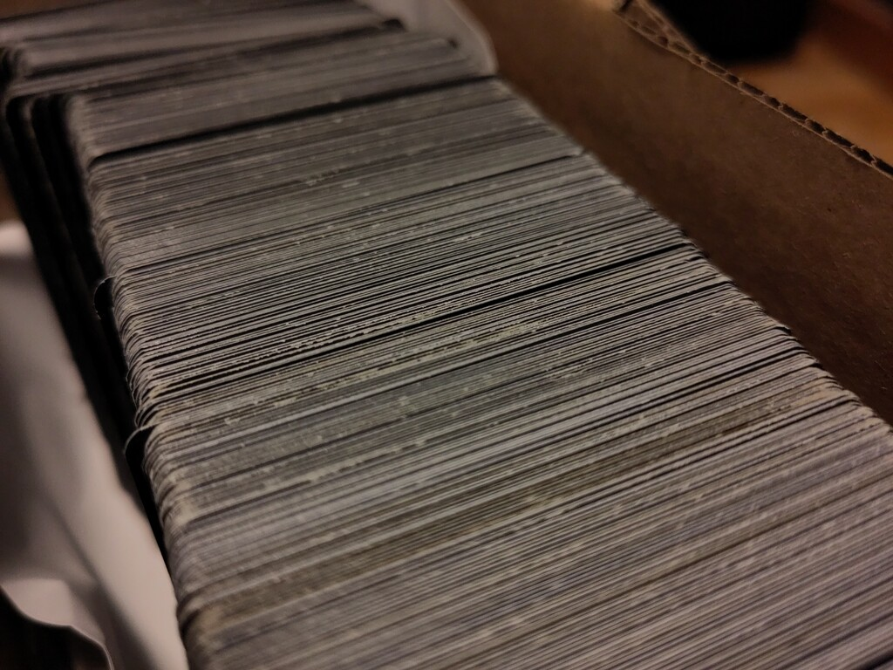

This is a typical ingest workload from an eBay bulk purchase. The majority of cards instantly appear to be heavily played, without even lifting them out of the stack. A stack of nearly mint fresh cards is perfectly uniform, with no visible wear on the card edges.

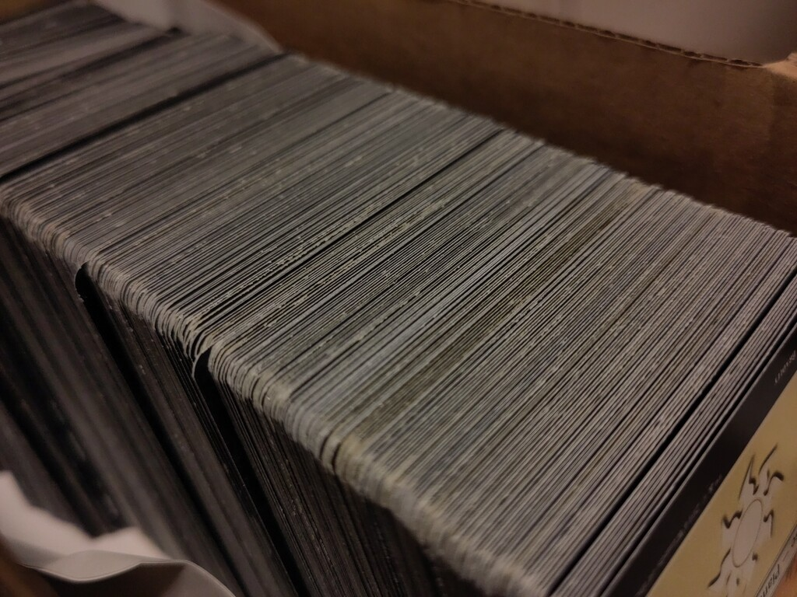

This is a slightly different view of the same area, to give a clearer impression.


These marks are quite deep. They are typical for finger nail damage. This card is clearly heavily played.


When inspecting cards, it's always helpful to have a spot light, or any other source of light that helps to run reflections over the surface of the card. Any surface imperfection that is visible without close inspection, clearly makes the card played. When we say "without close inspection", that means _anything_ that you spotted right away when running the first reflection over it. If there is only a single such imperfection, it is _marked_, and at best in good condition.


Here is a whole variety of damage types. Clearly a played card.


This cluster of impressions might come from surface contact with asphalt or rough stone, but especially the finer damage structures are common, and reproduced easily with any rough material. There are small specks of impressions, and fine scratches. Very clearly a played card.


Scratches in parallel lines are another common damage pattern, probably from directional movement while compressed.


Here, the same card is angled slightly differently, to show even more scratches further up.


These kinds of edges are indicative of moisture damage. If you actually handle the card, you also clearly see the expanded edge material where the moisture got in. Whenever you see a white line running through the black material, so that you get these small islands, it usually means the material was folded. It's then usually the top layer only that was folded, while the edge was dissolved.


The same card has another typical damage pattern at the top. This is also instantly clear when handling the card. You get this easily when only the corner of the card is under pressure, and you pull on the card.


Still the same card, showing extensive surface damage of all types. You also see these large areas where the surface just looks dull. This card is obviously in poor condition. A card looking dull, is generally the most acceptable wear though, and it's common in _good_ cards.


This card is destroyed, it is in poor condition.


These patterns are also typical for moisture damage. The torn-off top layer is usually seen together with expanded edges. If you follow the bottom edge of the card, you will see further white reflections, indicative of further edge expansion from moisture. This card is destroyed, and clearly in poor condition.


Now what about not so clear cases? This image shows two issues. We see some white spots on the black border on the edge of the card. And then there is a brown spot in the yellow part of the card. What's going on here?

The very first damage to appear on a card is usually the white spots at the edge. It is fairly common for cards in Near Mint condition to have minor cases of these. Similar to the abrasive damage that causes the dull look, the white spots on the border are where more attention would be necessary for a proper grading. One white spot more or less over the full front edge of the card, can ultimately decide a grade.

The brown spot is whatever dirt you can imagine. A good rule of thumb is: You will cause more damage with cleaning attempts, than you're doing any good. Whatever you do, this card is marked and never better than in _good_ condition.


Looking at the same card again, at the illustration, some typical imperfections show in the reflection again. Now it's clearly a played card.

### Grading Wisdom

Collecting coins has been around for decades. Coins are produced at a "mint", by being minted with a coin press. Simply put, you insert the blank block of precious metal into the machine, and then a big stamp presses down on it to squeeze the coin out of the block. The coin has been minted. It is mint fresh. It still has fine surface artifacts from the production mechanism, which are easily rubbed off during handling.

You can get such coins packaged directly at the mint, sealed in hard cases, with a proof of authenticity from the mint. Sound familiar?

Any coin that has been _circulated_ - it actually left the mint for its intended purpose - is no longer in mint condition. The [Sheldon coin grading scale] defines 70 different grades. There are 10 different, specific "Mint" sub-grades. That shitty foil Forest on eBay is _not Mint_!

## Money

All of this is a giant waste of money. There is no denying it. I have lived long enough to have wasted money at much larger scales, while simultaneously achieving total mental and physical demise. Any time being spent on _this_, is a net improvement. A Landrush collection might be worthless, but it will leave more happy memories than many alternative occupations I might be drawn to.

So far, the total cost of ownership is below 10,000 €. Let's leave it at that for now.

### How much is it worth?

As much as anyone would pay for it, is the easy answer. But what happens if I just load price information for all cards in the collection and sum it up? We get a roughly 40% increase on the investment. But this is useless, because price information is not accurate to the _print_. For almost any set, the prices for an English version card, and the same card in Chinese, are dramatically different. A 350 € Swamp can show up in price analysis as having a market value of 0.50 €.

Similarly, my stack of 200 identical Swamp cards is not worth 20 €.

It's really all just a big pile of cardboard without any value manifested in it. The value is received in the collection process.

[^wotc]: **Wizards of the Coast** is the original publisher of **Magic: The Gathering**. Today, it is a subsidiary of Hasbro.
[^gatherer]: The official card database, operated by Wizards of the Coast. Has no API, and data is not maintained to the same degree of quality as Scryfall.

[The Dark]: https://mtg.wiki/page/The_Dark
[Summer Magic / Edgar]: https://mtg.wiki/page/Revised_Edition#%22Summer_Magic%22/%22Edgar%22
[Black Lotus]: https://scryfall.com/card/leb/233/black-lotus
[Time Walk]: https://scryfall.com/card/leb/84/time-walk
[Underground Sea]: https://scryfall.com/card/leb/286/underground-sea
[Sheldon coin grading scale]: https://en.wikipedia.org/wiki/Sheldon_coin_grading_scale
