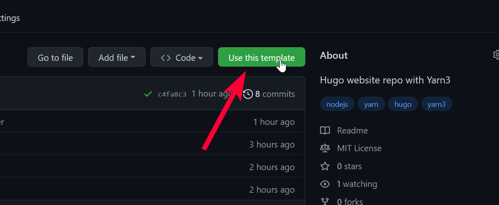

# yarn3-hugo Project Template

I've added a new project template to quickly set up a [Hugo](https://gohugo.io)-based website, like this blog.

## Get Started

To use this template, go to <https://github.com/oliversalzburg/yarn3-hugo> and click **Use this template**.

