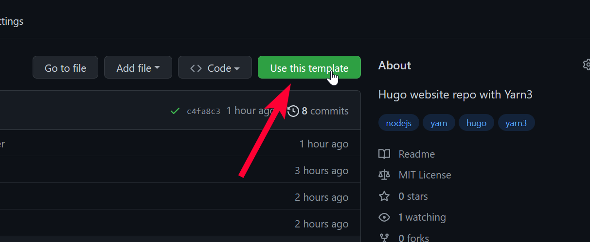

# yarn3-hugo Project Template

I've added a new project template to quickly set up a [Hugo](https://gohugo.io)-based website, like this blog.

## Get Started

To use this template, go to <https://github.com/oliversalzburg/yarn3-hugo> and click **Use this template**.

## Key Features

-   The project repository and dependencies are to be [managed with **modern Yarn** (Berry/v2/v3)](https://yarnpkg.com/).

    -   [Yarn Plug 'n' Play, or PnP](https://yarnpkg.com/features/pnp), has been disabled in favor of using `node_modules`. PnP is generally preferred for strictness, but `node_modules` incur less friction.

-   The project's primary output is a static website, [built with **Hugo**](https://gohugo.io/).

-   [Deploys to GitHub Pages](https://pages.github.com/), using [GitHub Actions](https://github.com/features/actions).

-   In-editor code quality assistence through [EditorConfig](https://editorconfig.org/) + [Prettier](https://prettier.io/) + [lint-staged](https://github.com/okonet/lint-staged).

    -   A git pre-commit hook for lint-staged is created through Yarn. [Husky](https://github.com/typicode/husky) is strictly discouraged.

-   Enables [Renovate](https://github.com/renovatebot/renovate) to keep dependencies updated. The dependency dashboard is disabled.

-   Where possible, Markdown formatting has been adjusted to conform to [Python-Markdown](https://python-markdown.github.io/#differences), so that it will work well with [MkDocs](https://www.mkdocs.org/). [mkdocs-material](https://squidfunk.github.io/mkdocs-material/) is the suggested route to adopt documentation.
